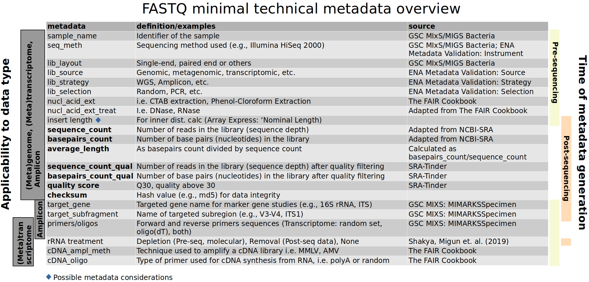
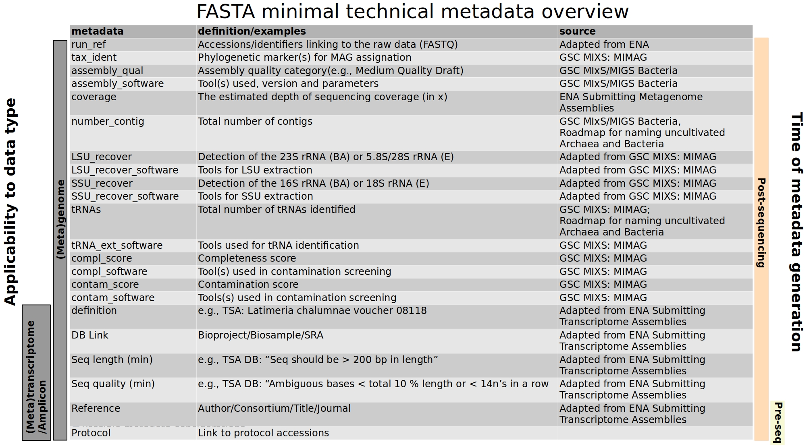
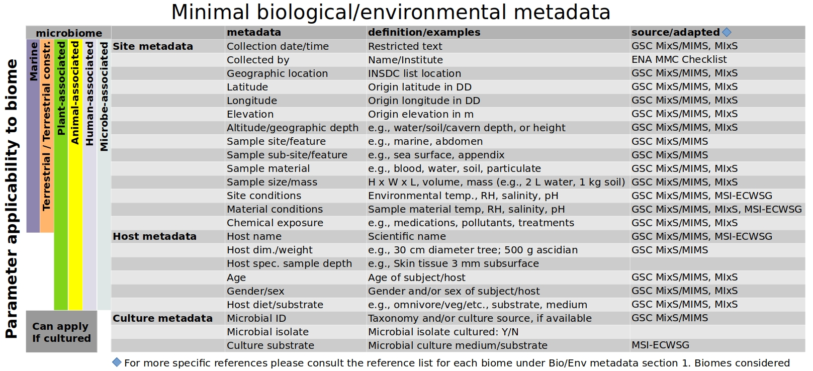
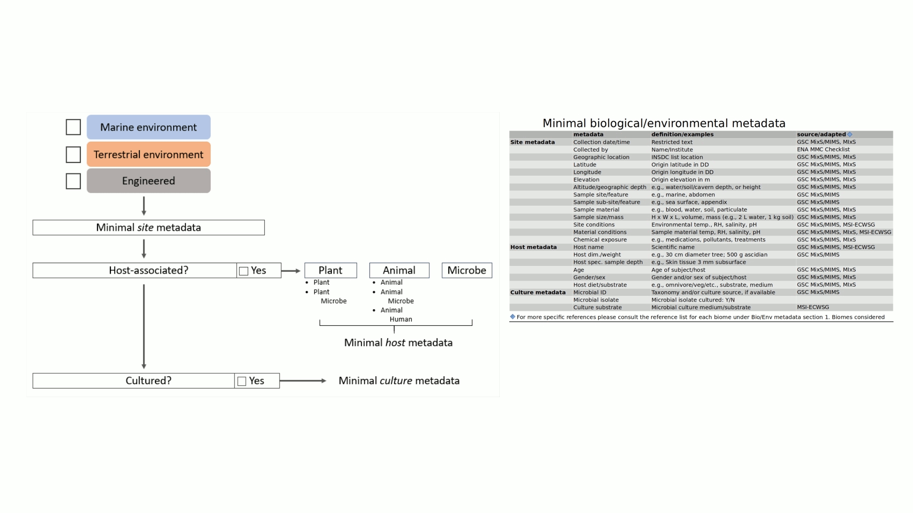
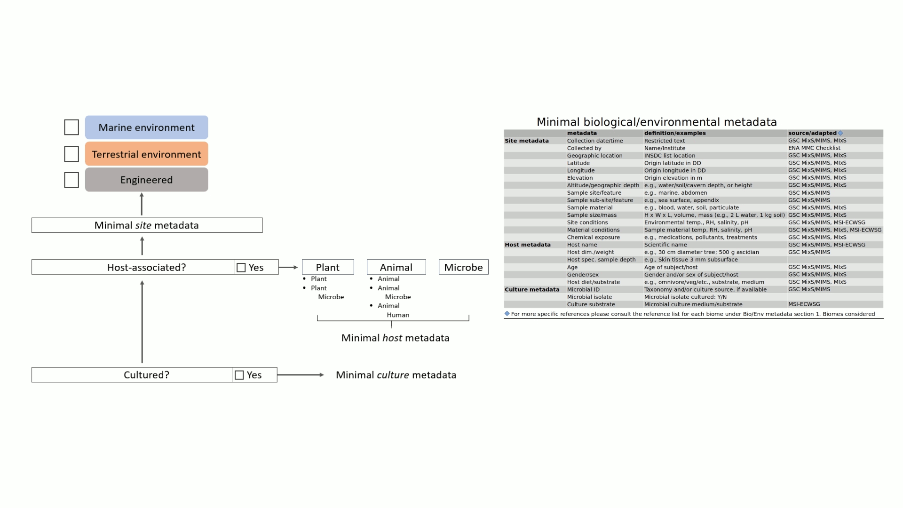

# NFDI4Microbiota - Metadata Standards

> [!TIP]
> Find out about research data management, FAIR principles for microbiology and more on our [Knowledge base](https://knowledgebase.nfdi4microbiota.de)!

The primary objective of this GitHub page is to serve as **a centralized
repository for existing (meta)data standards**. The purpose is to
provide the international microbiological community with a
**comprehensive and easily accessible compilation of established
standards**, facilitating efficient navigation and utilization for
researchers involved in collecting and submitting (meta)data to public
repositories.

The [NFDI4Microbiota](https://nfdi4microbiota.de) is a consortium that is part
of the German National research Data Infrastructure ([NFDI](https://www.nfdi.de/?lang=en)).
In line with the consortium’s objectives, this page aims to address the challenges of
microbial (meta)data accessibility and consistency. The efficient
exchange of usable information between research groups, sequencing
centers, and data repositories has been a long-standing issue. Measure
2.1 (M2.1) specifically focuses on maximizing data quality within the
[NFDI4Microbiota](https://nfdi4microbiota.de/)
consortium by enforcing compliance with existing standards and identifying
additional tailored data standards and metadata requirements.

**Goals:** By centralizing standard parameters
for metadata, the project ensures that generated data is reproducible
and comparable both spatially and temporally. To achieve this, two
**milestones** have been set:

-   defining data standards for different types of **raw data**, and
    ensuring their quality and reliability
-   defining data standards for **technical metadata**, further
    enhancing the consistency and usability of the collected metadata.
      

After additional consideration and overviews of the current literature,
the creators of this GitHub repository also agreed that the following
sections could and should be found here:

-   examples of **commonly used licenses** under which researchers can
    deposit data
-   brief description of use of **Ontologies** and how they help you
    describe your data

In the context of metadata quality standards in microbial science, two
main categories are being considered:

-   [**Technical**](#technical-metadata-standards)
-   [**Biological/Environmental**](#bio-env-metadata-standards)   

These categories aim to encompass the necessary information that
researchers collecting and submitting metadata to public repositories
need to provide. By adhering to these standardized metadata categories,
researchers can ensure the integrity and interoperability of their data,
enabling effective collaboration and comparative analysis within the
international microbiological community.

## 1. Reading this Github

-   Begin by reading the **[NFDI4Microbiota
    introduction](#N4Mintroduction), [Standards and
    Policies](#nfdi4microbiotastandardsandpolicies)** information, and
    **[Goals](#goals)**
-   Next, read the information regarding [**technical metadata standards
    section**](#technical-metadata-standards)
-   Third, read the [**biological/environmental metadata standards
    section**](#biological-and-environmental-metadata-standards)
-   Fourth if further explanation about licensing and ontologies is
    required, read [**Licenses and ontologies
    section**](#license-ontology)   

[**Figure 1.**](#figure1) Outlines the key aspects considered for
determining minimal metadata standards that can be universally
applicable across various datasets and microbiomes. These aspects
encompass both technical and biological/environmental (Bio/Env)
considerations. The figure illustrates the comprehensive approach used
to establish minimal metadata standards for diverse research settings by
combining already established standards for differing data types and
biomes.   

<!---
For making the access link for other people not on the collaborator list, it should be better to use the relative address instead of the constant one.
Thus, I replace the "https://github.com/mdsufz/NFDI4Microbiota_MetadataStandards/blob/main" with "."
-->

 **Figure 1. Flow Chart of Technical and
Biological/Environmental Metadata Standard Development**

This flow chart illustrates the process of developing metadata standards
for both Technical and Biological/Environmental aspects. Technical
parameters are categorized based on data types, while Bio/Env parameters
are organized according to biome types. Additionally, specific
considerations, such as file type and host, are taken into account to
enhance the comprehensiveness of the standards.

# Technical Metadata Standards

## 2. Technical metadata section

### 2.1. Data types

The following data types were considered when establishing minimal
**technical** metadata standards for M2.1:

-   Genomes
-   Amplicon
-   Metagenomes
-   Metagenome assembled genomes (MAGs)
-   Transcriptomes
-   Metatranscriptomes
-   Proteomes
-   Metaproteomes
-   Metabolomes  

Standard parameter considerations for FASTQ and FASTA formats are
displayed in [**Figure 2.**](#figure2) and [**Figure 3.**](#figure3),
respectively. Parameter applicability to different data types and the
time of data generation (i.e., before sequencing or during data
processing) are shown on the left and right, respectively.

Additionally, standards are being considered for [**data transfer and
data integrity**](#data-transfer-data-integrity) to ensure quality is
maintained throughout various processes of data file exchange.   

### 2.2. Overview of minimal technical FASTQ and FASTA metadata considerations

 **Figure 2. Overview of Minimal
Technical Metadata for FASTQ Files**

This figure provides an overview of the minimal technical metadata
relevant to FASTQ files. The left side lists the applicability of
parameters to different data types, such as (meta)genome,
(meta)transcriptome, etc. On the right side, the time of metadata
generation is indicated.   

 **Figure 3. Overview of Minimal
Technical Metadata for FASTA Files**

This figure presents an overview of the minimal technical metadata
relevant to FASTA files. On the left side, the applicability of
parameters to different data types, including (meta)genome,
(meta)transcriptome, etc., is listed. The right side provides
information about the time of metadata generation.   

### 2.3. Minimal technical metadata by technology and file type

Establishing a file-specific metadata standard list poses a significant
challenge due to variations in file types across instruments used in
metabolomic and proteomic analyses. Thus, researchers can find the
metadata standards for each specific technology within corresponding
links. This approach recognizes the complexities of defining
comprehensive and universally applicable metadata standards that differ
based on technology.

-   2.3.1. [Genome Sequencing](./Technical/Genome_Technical_Metadata.md)
    -   Genomic FASTQ
    -   Genomic FASTA
-   2.3.2. [Amplicon
    Sequencing](./Technical/Amplicon_Technical_Metadata.md)
    -   Amplicon FASTQ
-   2.3.3. [Metagenome
    Sequencing](./Technical/Metagenome_Technical_Metadata.md)
    -   Metagenome FASTQ
    -   Metagenome FASTA
    -   Metagenome assembled genome (MAG) FASTA
-   2.3.4. [Transcriptome
    Sequencing](./Technical/Transcriptome_Technical_Metadata.md)
    -   Transcriptome FASTQ
    -   Transcriptome FASTA
-   2.3.5. [Metatranscriptome
    Sequencing](./Technical/Metatranscriptome_Technical_Metadata.md)
    -   Metatranscriptome FASTQ
    -   Metatranscriptome FASTA
-   2.3.6. [Proteome
    sequencing](./Technical/Proteome_Technical_Metadata.md)
    -   Proteome
    -   Proteome - experimental protocol edition
-   2.3.7. Metaproteome sequencing
-   2.3.8. [Metabolome
    sequencing](./Technical/Metabolome_Technical_Metadata.md)
    -   Metabolome
    -   Metabolome - experimental protocol edition
-   2.3.9. [uVIGs](./Technical/uVIGs_Technical_Metadata.md)
    -   uVIG FASTQ
    -   uVIG FASTA
-   2.3.10. [BIOM or tabular
    files](./Technical/BIOM_or_Tabular_Technical_Metadata.md)

### 2.4. Data transfer and data integrity

The work of the [Data transfer and data
integrity](./Technical/Data_Transfer_Data_Integrity.md) section focuses
on:

-   Examples of existing data transfer & data integrity checks
-   Data integrity considerations by file type 

# Biological and Environmental Metadata Standards

## 3. Bio/Env metadata section

### 3.1. Biomes considered

Six microbiomes were considered to compile a minimal set of biological
and environmental metadata standards. Environmental and biological
parameters were identified as minimums applicable to individual biomes
and/or hosts.

The Minimal **Biological and Environmental** microbiome metadata
standards within M2.1 were collected to apply to the following biomes:

-   [Marine](./Biological_Environmental/Marine_BioEnv_Metadata.md)
-   [Terrestrial](./Biological_Environmental/Terrestrial_BioEnv_Metadata.md)
-   [Terrestrial
    (constructed)](./Biological_Environmental/TerrestrialConstructed_BioEnv_Metadata.md)
-   [Plant-associated](./Biological_Environmental/PlantAssoc_BioEnv_Metadata.md)
-   [Animal-associated](./Biological_Environmental/AnimalAssoc_BioEnv_Metadata.md)
-   [Human-associated](./Biological_Environmental/Human_BioEnv_Metadata.md)
-   Microbe-associated

Tentative standard minimal biological and environmental parameter
considerations are displayed in [**Figure 4**](#figure4). Parameter
applicability to different biomes are shown on the left axis.

 **Figure 4. Tentative Minimal
Biological and Environmental Metadata**.

This figure presents the division of minimal biological and
environmental metadata into distinct categories. Site metadata includes
specifications and environmental parameters related to the geographic
sampling location, while sample material and host metadata provide
information specific to host-associated systems. The applicability of
these standards to different microbiomes is shown on the left.
Additionally, conditional metadata standards encompass pertinent minimal
cultivation information.

The references in the figure are from the following sources:

-   **Marine references**:
    -   GSC MIxS: Water MIMS (“GSC MIxS: WaterMIMS”)
    -   ENA MMC: ENA Checklist: Marine Microalgae (“ENA Marine
        Microalgae Checklist; Checklist: ERC000043”)
    -   ENA Tara Oceans; Checklist: ERC000030 (“ENA Tara Oceans;
        Checklist: ERC000030”)
    -   GSC Minimum Information about any (x) Sequence (MIxS); ENA
        checklist: Water environment (“GSC MIxS Water; ENA Checklist:
        ERC000024”)
    -   The environment ontology: contextualising biological and
        biomedical entities (Buttigieg et al. 2013)
    -   The minimum information about a genome sequence (MIGS)
        specification (Field et al. 2008)
    -   Minimum information about a marker gene sequence (MIMARKS) and
        minimum information about any (x) sequence (MIxS) specifications
        (Yilmaz et al. 2011)
    -   A standard MIGS/MIMS compliant XML Schema: Toward the
        development of the Genomic Contextual Data Markup Language
        (GCDML) (Kottmann et al. 2008)
    -   Standard reporting requirements for biological samples in
        metabolomics experiments: environmental context (Morrison et al.
        2007)
-   **Terrestrial / Terrestrial(constructed)**
    -   GSC MIxS: Miscellaneous Natural Or Artificial Environment MIMS
        (“GSC MIxS: MiscellaneousNaturalOrArtificialEnvironmentMIMS”)
    -   GSC MIxS: Sediment MIMS (“GSC MIxS: SedimentMIMS”)
    -   GSC MIXS: Soil MIMS (“GSC MIxS: SoilMIMS”)
    -   GSC MIxS: Wastewater Sludge MIMS (“GSC MIxS:
        WastewaterSludgeMIMS”)
    -   GSC MIxS: Built Environment MIMS (“GSC MIxS:
        BuiltEnvironmentMIMS”)
    -   The environment ontology: contextualising biological and
        biomedical entities (Buttigieg et al. 2013)
    -   The minimum information about a genome sequence (MIGS)
        specification (Field et al. 2008)
    -   Minimum information about a marker gene sequence (MIMARKS) and
        minimum information about any (x) sequence (MIxS) specifications
        (Yilmaz et al. 2011)
    -   A standard MIGS/MIMS compliant XML Schema: Toward the
        development of the Genomic Contextual Data Markup Language
        (GCDML) (Kottmann et al. 2008)
    -   Standard reporting requirements for biological samples in
        metabolomics experiments: environmental context (Morrison et al.
        2007)
-   **Plant-associated**
    -   GSC MIxS: Plant-associated MIMS (“GSC MIxS:
        Plant-associatedMIMS”)
    -   GSC MIxS: Agriculture MIMS (“GSC MIxS: AgricultureMIMS”)
    -   GSC MIxS: Symbiont-associated MIMS (“GSC MIxS:
        Symbiont-associatedMIMS”)
    -   ENA MMC: ENA Checklist: Marine Microalgae (“ENA Marine
        Microalgae Checklist; Checklist: ERC000043”)
    -   The environment ontology: contextualising biological and
        biomedical entities (Buttigieg et al. 2013)
    -   The minimum information about a genome sequence (MIGS)
        specification (Field et al. 2008)
    -   Minimum information about a marker gene sequence (MIMARKS) and
        minimum information about any (x) sequence (MIxS) specifications
        (Yilmaz et al. 2011)
    -   A standard MIGS/MIMS compliant XML Schema: Toward the
        development of the Genomic Contextual Data Markup Language
        (GCDML) (Kottmann et al. 2008)
    -   Standard reporting requirements for biological samples in
        metabolomics experiments: environmental context (Morrison et al.
        2007)
-   **Animal-associated**
    -   GSC MIxS: Host-associated MIMS (“GSC MIxS: Host-associatedMIMS”)
    -   The environment ontology: contextualising biological and
        biomedical entities (Buttigieg et al. 2013)
    -   The minimum information about a genome sequence (MIGS)
        specification (Field et al. 2008)
    -   Minimum information about a marker gene sequence (MIMARKS) and
        minimum information about any (x) sequence (MIxS) specifications
        (Yilmaz et al. 2011)
    -   A standard MIGS/MIMS compliant XML Schema: Toward the
        development of the Genomic Contextual Data Markup Language
        (GCDML) (Kottmann et al. 2008)
    -   Standard reporting requirements for biological samples in
        metabolomics experiments: environmental context (Morrison et al.
        2007)
-   **Human-associated**
    -   MIMS: metagenome/environmental, human-associated; version 6.0
        Package (“MIMS: Metagenome/Environmental, Human-Associated;
        Version 6.0 Package”)
    -   GSC MIxS human associated; ENA Checklist: ERC000014 (“GSC MIxS
        Human Associated; ENA Checklist: ERC000014”)
    -   GSC MIxS: Human-associated MIMS (“GSC MIxS:
        Human-associatedMIMS”)
    -   GSC MIxS: Human-gut MIMS (“GSC MIxS: Human-gutMIMS”)
    -   GSC MIxS: Human-oral MIMS (“GSC MIxS: Human-oralMIMS”)
    -   GSC MIxS: Human-skin MIMS (“GSC MIxS: Human-skinMIMS”)
    -   GSC MIxS: Human-vaginal MIMS (“GSC MIxS: Human-vaginalMIMS”)
    -   The environment ontology: contextualising biological and
        biomedical entities (Buttigieg et al. 2013)
    -   The minimum information about a genome sequence (MIGS)
        specification (Field et al. 2008)
    -   Minimum information about a marker gene sequence (MIMARKS) and
        minimum information about any (x) sequence (MIxS) specifications
        (Yilmaz et al. 2011)
    -   A standard MIGS/MIMS compliant XML Schema: Toward the
        development of the Genomic Contextual Data Markup Language
        (GCDML) (Kottmann et al. 2008)
    -   Standard reporting requirements for biological samples in
        metabolomics experiments: environmental context (Morrison et al.
        2007)
    -   U.S. Office of Management and Budget (OMB): About the Topic of
        Race (“U.s. Office of Management and Budget (OMB): About the
        Topic of Race”)
-   **Microbe-associated**
    -   GSC MIxS: Miscellaneous Natural Or Artificial Environment MIMS
        (“GSC MIxS: MiscellaneousNaturalOrArtificialEnvironmentMIMS”)
    -   GSC MIxS: Sediment MIMS (“GSC MIxS: SedimentMIMS”)
    -   GSC MIXS: Soil MIMS (“GSC MIxS: SoilMIMS”)
    -   GSC MIxS: Wastewater Sludge MIMS (“GSC MIxS:
        WastewaterSludgeMIMS”)
    -   GSC MIxS: Microbial Mat Biofilm MIMS (“GSC MIXS:
        MicrobialMatBiofilmMIMS”)
    -   The environment ontology: contextualising biological and
        biomedical entities (Buttigieg et al. 2013)
    -   The minimum information about a genome sequence (MIGS)
        specification (Field et al. 2008)
    -   Minimum information about a marker gene sequence (MIMARKS) and
        minimum information about any (x) sequence (MIxS) specifications
        (Yilmaz et al. 2011)
    -   A standard MIGS/MIMS compliant XML Schema: Toward the
        development of the Genomic Contextual Data Markup Language
        (GCDML) (Kottmann et al. 2008)
    -   Standard reporting requirements for biological samples in
        metabolomics experiments: environmental context (Morrison et al.
        2007)
    -   Minimum information about a single amplified genome (MISAG) and
        a metagenome-assembled genome (MIMAG) of bacteria and archaea
        (Bowers et al. 2017)
    -   Roadmap for naming uncultivated Archaea and Bacteria (Murray et
        al. 2020)

### 3.2. Data/metadata categorization

The categorization framework in [**Figure 5**](#figure5) should be
considered when determining the applicable metadata standards for each
dataset. This framework can serve as a valuable tool for connecting
information about samples from marine, terrestrial, or engineered
systems. Additionally, it facilitates the inclusion of cultivated
samples, whether they were cultured from a commercially-available source
or isolated from an environmental sample by the user.

To enhance searchability in downstream analyses, users can select
multiple environment categories if relevant. For instance, they may
choose both “marine” and “terrestrial” for a tidal flat site,
“engineered” and “terrestrial” for a greenhouse agricultural site, or
“engineered” and “marine” for a commercially-available culture initially
isolated from the ocean.   

#### **Category Flow Chart**

**Figure 5. Tentative Categorization Framework for
Biological/Environmental Metadata Requirements**

This figure showcases a preliminary categorization framework to
establish minimal biological/environmental metadata requirements. The
framework connects host-associated systems to marine, terrestrial, or
engineered environments while enabling effective tracking of data
affiliated with cultivated samples. The structure should provide
valuable insights for organizing and comprehensively accessing diverse
datasets.

**Figures 6 - 8** show examples of minimal biological/environmental
metadata applicability to different sample categorizations. 

#### **Human Gut Example**

 **Figure 6.
Example of Categorizing a Human Gut-Associated and Cultivated Sample
with Applicable Minimal Metadata**

This figure provides an illustrative example of the categorization
process for a human gut-associated and cultivated sample. It showcases
the minimal metadata that are applicable and relevant for this specific
sample type.

#### **Tidal Flat Example**

 **Figure
7. Example of Categorizing a Tidal Flat and Cultivated Sample with
Applicable Minimal Metadata**

This figure presents a practical example of categorizing a tidal flat
cultivated sample, along with the relevant minimal metadata. The
illustration demonstrates how the proposed framework accommodates
overlapping environments, such as terrestrial and marine, specifically
for intertidal regions.

#### **Lab Culture Example**

 **Figure
8. Example of Categorizing a Known Lab Cultured Sample with Applicable
Minimal Metadata**

This figure presents an example of categorizing a known lab-cultured
sample, along with the corresponding minimal metadata. The
bidirectionality of the categorization framework is highlighted, as it
enables the linkage between known, commercially available cultures and
their original sample environments.

## Licenses and ontologies section

### 4. Use of licenses for deposited data

When depositing data to public repositories, researchers can use
established licenses to set certain restrictions on its use **or**
requiring certain acknowledgments when reusing it **or** publish it to
the public domain without any limitations. Licensing your data under
specific licenses enables other researchers to reuse your data (under
certain conditions), without explicit permission from the data
submitter. In any case, it is recommended to consider various factors
before deciding upon a deed (license). Ethical, privacy, and security
considerations may heavily influence the licensing process. The most
common licenses under use were established by a US non-profit
organization called [Creative Commons
(CC)](https://creativecommons.org/). We encourage the readers of this
repository to visit their site and familiarize themselves with the
process, logic, and use of licenses in detail. The CC homepage also
holds the [Frequently Asked Questions
(FAQ)](https://creativecommons.org/faq/) section. Here, we will only
briefly describe some of the [CC
licenses](https://creativecommons.org/share-your-work/cclicenses/). So,
in the end, researchers should think about how they want other people to
use their work and why they want to share their work in the first place
before deciding upon a deed (license).

Commonly used licenses:

-   [CC-BY](https://creativecommons.org/licenses/by/4.0/): Credit must
    be given to the creator.
-   [CC BY-SA](https://creativecommons.org/licenses/by-sa/4.0/): Credit
    must be given to the creator. Adaptations must be shared under the
    same terms.
-   [CC BY-NC](https://creativecommons.org/licenses/by-nc/4.0/): Credit
    must be given to the creator. Only noncommercial uses of the work
    are permitted.
-   [CC BY-NC-SA](https://creativecommons.org/licenses/by-nc-sa/4.0/):
    Credit must be given to the creator. Only noncommercial uses of the
    work are permitted. Adaptations must be shared under the same terms.
-   [CC BY-ND](https://creativecommons.org/licenses/by-nd/4.0/): Credit
    must be given to the creator. No derivatives or adaptations of the
    work are permitted.
-   [CC BY-NC-ND](https://creativecommons.org/licenses/by-nc-nd/4.0/):
    Credit must be given to the creator. Only noncommercial uses of the
    work are permitted. No derivatives or adaptations of the work are
    permitted.
-   [CC0](https://creativecommons.org/publicdomain/zero/1.0/): Public
    domain dedication.

<table style="width:60%;">
<tr>
<th style="text-align: center;">
Acronym
</th>
<th style="text-align: center;">
Explanation
</th>
</tr>
<tr>
<td style="text-align: center;">
BY
</td>
<td style="text-align: center;">
Credit must be given to the creator
</td>
</tr>
<tr>
<td style="text-align: center;">
SA
</td>
<td style="text-align: center;">
Adaptations must be shared under the same terms
</td>
</tr>
<tr>
<td style="text-align: center;">
NC
</td>
<td style="text-align: center;">
Only noncommercial uses of the work are permitted
</td>
</tr>
<tr>
<td style="text-align: center;">
ND
</td>
<td style="text-align: center;">
No derivatives or adaptations of the work are permitted
</td>
</tr>
<tr>
<td style="text-align: center;">
0
</td>
<td style="text-align: center;">
Public domain dedication
</td>
</tr>
</table>

[CC-BY](https://creativecommons.org/licenses/by/4.0/): When data is
deposited under this deed (license), and it becomes free to share and
free to redistribute, including commercially, in any format or medium.
It also allows the user to build upon or transform the data/material for
any purpose, including commercial purposes. The deed (license) requires
the data reuser to give appropriate credit to the submitter/data
generator. In addition, the reuser must also provide a link to the deed
(license) and disclose any changes made when licensing their work when
derived from work already under deed (license).  

[CC0](https://creativecommons.org/publicdomain/zero/1.0/): When using
this deed (license), the data/material becomes a part of the public
domain. That means that the data deposited can be copied, modified,
distributed, and used even for commercial purposes, and the
depositor/generator of the data waives their right to the work. The
reuser of data does not need to seek the permission of the data/material
submitter or generator.

### 5. Use of controlled vocabularies (Ontologies)

Before discussing controlled vocabularies (ontologies), we first need to
talk about what they are and why you should care. In this section, we
will interchangeably use the terms controlled vocabulary and ontology.

Let us dial the clock back a few centuries when Latin was the lingua
franca of academics. It provided a link between knowledge and sciences
from different backgrounds and languages (not to mention periods), along
with consistency and clarity. So, no matter what language you spoke in
your everyday life, Latin was there to help you understand the work of
an academic who lived halfway across the globe or several centuries
before. The common ground enabled ideas to spread and be built upon
existing knowledge without the burden of translation. 

Much like in the past, nowadays, controlled vocabularies allow for
almost seamless communication and knowledge transfer between researchers
and between researchers and computers. Ontologies provide a common
language by defining and standardizing terms used in a particular field
of research. That reduces the chance of miscommunication and
misunderstandings. Ontologies also make data adaptable to new research
and discoveries and can provide a deeper understanding and uncover
patterns and insights on the subject being explored. They also make
navigation through (almost) endless rows of data easier with defined
search patterns. 

Furthermore, the best thing about ontologies is that they are still
evolving. Several research groups are updating and defining new terms,
classes, and subclasses of ontologies to keep up with new discoveries
and knowledge. There are, of course, several edge cases where ontologies
are not yet defined, or even multiple ontologies can apply. But we
highly encourage the readers of this GitHub not to get disheartened by
the multitude of websites that provide these controlled vocabularies.

#### 5.1 Examples of Ontologies use

Let us imagine a theoretical experiment where we are taking metagenomic
samples, and we would like the rest of the world to know (and also
perhaps our future self) where and how exactly we collected our samples.
This is something we can consider at the time of planning our
experiment. We know that we will be collecting metagenomic samples from
the rhizosphere from a forest in Germany and sequencing them using
Illumina sequencing technologies. With this, we can begin describing our
samples.

We hop on over to the [EMBL-EBI Ontology Lookup Service
(OLS)](https://www.ebi.ac.uk/ols4/). As we (in this thought experiment)
are unfamiliar with the ontologies, we start the search for the broadest
description we can think of, and that is probably biome
[\[ENVO_00000428\]](https://www.ebi.ac.uk/ols4/ontologies/envo/classes/http%253A%252F%252Fpurl.obolibrary.org%252Fobo%252FENVO_00000428?lang=en),
so that is what we do, type biome in the search engine and hit enter. We
are greeted with several [results of the
search](https://www.ebi.ac.uk/ols4/search?q=biome). We take a closer
look at biome
[\[ENVO_00000428\]](https://www.ebi.ac.uk/ols4/ontologies/envo/classes/http%253A%252F%252Fpurl.obolibrary.org%252Fobo%252FENVO_00000428?lang=en),
and find that there are several subclasses of it, that can help us
describe the sample. As we think about it, we come to the conclusion,
that the next class that could describe our sample is terrestrial biome
[\[ENVO:00000446\]](https://www.ebi.ac.uk/ols4/ontologies/envo/classes/http%253A%252F%252Fpurl.obolibrary.org%252Fobo%252FENVO_00000446?lang=en),
but that is to broad of a description, so the search continues. After
some clicking and searching, we discover, that there is a certain
subclass called woodland biome
[\[ENVO:01000175\]](http://purl.obolibrary.org/obo/ENVO_01000175), and
even a further subclass of it called temperate woodland biome
[\[ENVO:01000221\]](http://purl.obolibrary.org/obo/ENVO_01000221). This
should adequately describe the broad sense of what kind of samples we
have. However, we are not yet happy with our search, as we have yet to
define where exactly our samples come from in the temperate woodland
biome. At the same time, we have exhausted the subclasses in our current
search, so we return to the main page. We type in the term
[rhizosphere](https://www.ebi.ac.uk/ols4/search?q=rhizosphere+) and hit
search. Based on the result, we see that the rhizosphere environment
[\[ENVO:01000999\]](http://purl.obolibrary.org/obo/ENVO_01000999) might
be something that could describe our sample, but let us take a closer
look at the description. The description reads Ontology which reads: “An
environmental system determined by the presence of a plant
rhizosphere.”. So, we have defined the origin of our sample.

A similar logic can be applied and used to let the world know that the
sampling was done in Germany, in the Naturpark Frankenwald
[\[GAZ:00632507\]](http://purl.obolibrary.org/obo/GAZ_00632507), that we
are using Illumina Sequencing
[\[NCIT:C146817\]](http://purl.obolibrary.org/obo/NCIT_C146817), that we
used minimal defined medium
[\[MCO:0000881\]](http://purl.obolibrary.org/obo/MCO_0000881), etc.

Note here that we highly encourage the readers of this repository to
read the [EnvO s use
documentation](https://github.com/EnvironmentOntology/envo/wiki/Using-ENVO-with-MIxS)
if the examples given here are unclear.

# About

  This work is licensed under a [Creative Commons Attribution 4.0 International License](http://creativecommons.org/licenses/by/4.0/).

# References

Bowers, R., N. Kyrpides, R. Stepanauskas, et al. 2017. “Minimum
Information about a Single Amplified Genome (MISAG) and a
Metagenome-Assembled Genome (MIMAG) of Bacteria and Archaea.” *Nat
Biotechnol* 35: 725–31. <https://doi.org/10.1038/nbt.3893>.

Buttigieg, P. L., N. Morrison, B. Smith, C. J. Mungall, S. E. Lewis, and
ENVO Consortium. 2013. “The Environment Ontology: Contextualising
Biological and Biomedical Entities.” *Journal of Biomedical Semantics* 4
(1): 43. <https://doi.org/10.1186/2041-1480-4-43>.

“ENA Marine Microalgae Checklist; Checklist: ERC000043.”
<https://www.ebi.ac.uk/ena/browser/view/ERC000043>.

“ENA Tara Oceans; Checklist: ERC000030.”
<https://www.ebi.ac.uk/ena/browser/view/ERC000030>.

Field, D., G. Garrity, T. Gray, N. Morrison, J. Selengut, P. Sterk, T.
Tatusova, et al. 2008. “The Minimum Information about a Genome Sequence
(MIGS) Specification.” Nature Biotechnology. 2008.
<https://doi.org/10.1038/nbt1360>.

“German National Research Data Infrastructure.”
<https://www.nfdi.de/?lang=en>.

“GSC MIxS Human Associated; ENA Checklist: ERC000014.”
<https://www.ebi.ac.uk/ena/browser/view/ERC000014>.

“GSC MIxS Water; ENA Checklist: ERC000024.”
<https://www.ebi.ac.uk/ena/browser/view/ERC000024>.

“GSC MIxS: AgricultureMIMS.”
<https://genomicsstandardsconsortium.github.io/mixs/AgricultureMIMS/>.

“GSC MIxS: BuiltEnvironmentMIMS.”
<https://genomicsstandardsconsortium.github.io/mixs/BuiltEnvironmentMIMS/>.

“GSC MIxS: Host-associatedMIMS.”
<https://genomicsstandardsconsortium.github.io/mixs/Host-associatedMIMS/>.

“GSC MIxS: Human-associatedMIMS.”
<https://genomicsstandardsconsortium.github.io/mixs/Human-associatedMIMS/>.

“GSC MIxS: Human-gutMIMS.”
<https://genomicsstandardsconsortium.github.io/mixs/Human-gutMIMS/>.

“GSC MIxS: Human-oralMIMS.”
<https://genomicsstandardsconsortium.github.io/mixs/Human-oralMIMS/>.

“GSC MIxS: Human-skinMIMS.”
<https://genomicsstandardsconsortium.github.io/mixs/Human-skinMIMS/>.

“GSC MIxS: Human-vaginalMIMS.”
<https://genomicsstandardsconsortium.github.io/mixs/Human-vaginalMIMS/>.

“GSC MIXS: MicrobialMatBiofilmMIMS.”
<https://genomicsstandardsconsortium.github.io/mixs/MicrobialMatBiofilmMIMS/>.

“GSC MIxS: MiscellaneousNaturalOrArtificialEnvironmentMIMS.”
<https://genomicsstandardsconsortium.github.io/mixs/MiscellaneousNaturalOrArtificialEnvironmentMIMS/>.

“GSC MIxS: Plant-associatedMIMS.”
<https://genomicsstandardsconsortium.github.io/mixs/Plant-associatedMIMS/>.

“GSC MIxS: SedimentMIMS.”
<https://genomicsstandardsconsortium.github.io/mixs/SedimentMIMS/>.

“GSC MIxS: SoilMIMS.”
<https://genomicsstandardsconsortium.github.io/mixs/SoilMIMS/>.

“GSC MIxS: Symbiont-associatedMIMS.”
<https://genomicsstandardsconsortium.github.io/mixs/Symbiont-associatedMIMS/>.

“GSC MIxS: WastewaterSludgeMIMS.”
<https://genomicsstandardsconsortium.github.io/mixs/WastewaterSludgeMIMS/>.

“GSC MIxS: WaterMIMS.”
<https://genomicsstandardsconsortium.github.io/mixs/WaterMIMS/>.

Kottmann, R., T. Gray, S. Murphy, L. Kagan, S. Kravitz, T. Lombardot, D.
Field, F. O. Glöckner, and Genomic Standards Consortium. 2008. “A
Standard MIGS/MIMS Compliant XML Schema: Toward the Development of the
Genomic Contextual Data Markup Language (GCDML).” OMICS: A Journal of
Integrative Biology. 2008. <https://doi.org/10.1089/omi.2008.0A10>.

“MIMS: Metagenome/Environmental, Human-Associated; Version 6.0 Package.”
<https://www.ncbi.nlm.nih.gov/biosample/docs/packages/MIMS.me.human-associated.5.0/>.

Morrison, Norman, Daniel Bearden, Jacob G. Bundy, Timothy Collette,
Fraser Currie, Matthew Davey, Migdalia Dominguez, et al. 2007. “Standard
Reporting Requirements for Biological Samples in Metabolomics
Experiments: Environmental Context.” *Metabolomics* 3 (2): 203–10.
<https://doi.org/10.1007/s11306-007-0067-1>.

Murray, A. E., J. Freudenstein, S. Gribaldo, et al. 2020. “Roadmap for
Naming Uncultivated Archaea and Bacteria.” *Nat Microbiol* 5: 987–94.
<https://doi.org/10.1038/s41564-020-0733-x>.

“NFDI4Microbiota.” <https://nfdi4microbiota.de/>.

“U.s. Office of Management and Budget (OMB): About the Topic of Race.”
<https://www.census.gov/topics/population/race/about.html>.

Yilmaz, Pelin et al. 2011. “Minimum Information about a Marker Gene
Sequence (MIMARKS) and Minimum Information about Any (x) Sequence (MIxS)
Specifications.” *Nature Biotechnology* 29 (5): 415–20.
<https://doi.org/10.1038/nbt.1823>.
