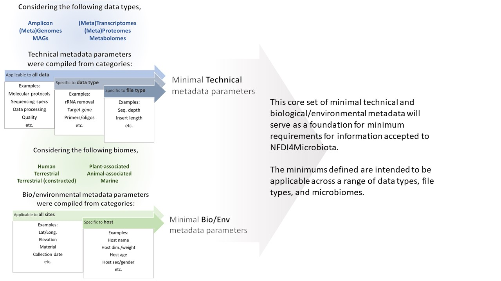
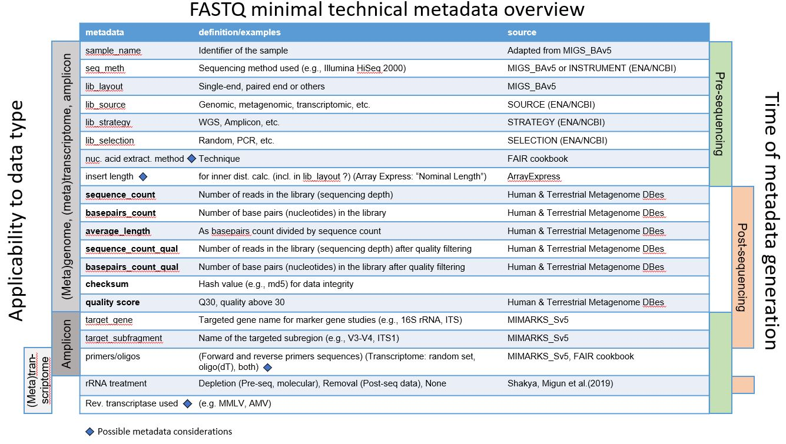
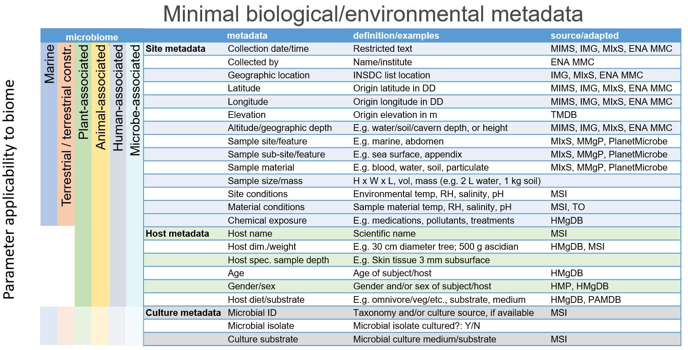
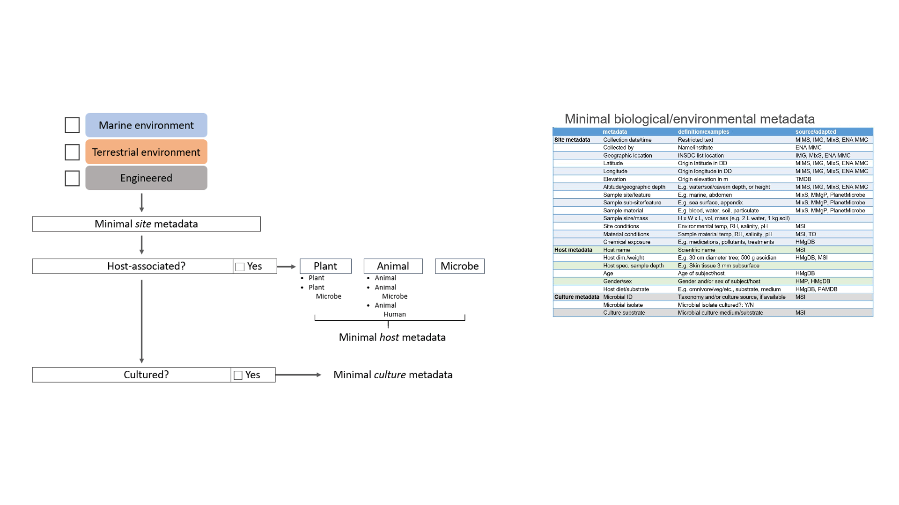

# NFDI4Microbiota - Metadata Standards

## Reading this Github

- Begin by reading the [NFDI4Microbiota introduction](#nfdi4microbiota-introduction), [Standards and Policies](#nfdi4microbiota---standards-and-policies) information, and [Goals and Milestones](#goals-and-milestones)
- Next, read the information regarding [**technical** metadata parameter standards](#technical-metadata-standards)
- Third, read the [**biological/environmental** metadata standards section](#biological-and-environmental-metadata-standards)

## NFDI4Microbiota introduction

The National Research Data Infrastructure Germany (NFDI) is currently comprised of 19 consortium members spanning diverse fields, including physical sciences, human health, biology, artificial intelligence, cultural and economic science, among others[^19]. In July 2021, NFDI4Microbiota was selected to become a consortium member and holds a mission "_to be the central hub in Germany for supporting the microbiology community with access to data, analysis services, data/metadata standards and training_."[^20] Through building analytical tools, ensuring FAIR principles are followed, and standardizing metadata and data processing, NFDI4Microbiota will contribute to the interdisciplinary NFDI network from the microbiological perspective. 

## NFDI4Microbiota - Standards and Policies

NFDI4Microbiota aims to address issues of microbial data accessibility and consistency. These issues have long presented challenges for the efficient  exchange of useable information between research groups, data generators (e.g. sequencing centers), and data repositories. Specifically, Measure 2.1 (M2.1) has the goal "_to maximize the quality of data entering the NFDI4Microbiota system by enforcing compliance with existing standards, as well as to identify and promote additional tailored data standards and metadata requirements within the NFDI4Microbiota systems._" Establishing standard parameters for metadata will ensure that generated data is reproducible and comparable, both spatially and temporally.

## Goals and Milestones

**Goals**: To maximize the quality of data entering the NFDI4Microbiota system by enforcing compliance with existing standards, as well as to identify and promote additional tailored data standards and metadata requirements within the NFDI4Microbiota systems through the following two milestones:
- Definition of data standards for the different types of raw data established
- Definition of data standards for the technical metadata established

To address metadata quality standards in microbial science, two metadata categories are being considered:

- Technical 
- Biological/Environmental

Figure 1 outlines the aspects of both technical and biological/environmental (Bio/Env) that were taken into account when determining metadata parameters that would be applicable across various datasets and microbiomes. 

<!---
For making the access link for other people not on the collaborator list, it should be better to use the relative address instead of the constant one.
Thus, I replace the "https://github.com/mdsufz/NFDI4Microbiota_MetadataStandards/blob/main" with "."
-->

**Figure 1**. Flow chart of Technical and Biological/Environmental metadata standard development. Technical parameter categories were structured based on data types, and bio/env parameter categories were based on biome type. More specific considerations were taken into account for file type, host, etc. 

# Technical Metadata Standards

## Technical metadata section 1. Data types

The following data types were considered when establishing minimal **technical** metadata standards for M2.1:
- Genomes
- Amplicon
- Metagenomes
- Metagenome assembled genomes
- Transcriptomes
- Metatranscriptomes
- Proteomes
- Metaproteomes
- Metabolomes

Standard parameter considerations for FASTQ and FASTA formats are displayed in Figures 2 and 3, respectively. Parameter applicability to different data types and the time of data generation (i.e. before sequencing or during data processing) are shown in the left and right, respectively.
 
Additionally, standards are being considered for data integrity and data transfer to ensure quality is maintained throughout various processes of data file exchange. 

## Technical metadata section 2. Overview of minimal technical FASTQ and FASTA metadata considerations.

**Figure 2.** Overview of minimal technical metadata considered for FASTQ files. Parameter applicabilty to data types ((meta)genome, (meta)transcriptome, etc.) is listed on the left, and time of metadata generation is listed on the right. 

**Figure 3.** Overview of minimal technical metadata considered for FASTA files. Parameter applicabilty to data types ((meta)genome, (meta)transcriptome, etc.) is listed on the left, and time of metadata generation is listed on the right.

## Technical metadata section 3. Minimal technical metadata by technology and file type 

- 2.1 [Genome Sequencing](./Technical/Genome_Technical_Metadata.md)
  - Genomic FASTQ
  - Genomic FASTA
- 2.2 [Amplicon Sequencing](./Technical/Amplicon_Technical_Metadata.md)
  - Amplicon FASTQ
- 2.3 [Metagenome Sequencing](./Technical/Metagenome_Technical_Metadata.md)
  - Metagenome FASTQ
  - Metagenome FASTA
  - Metagenome assembled genome FASTA
- 2.4 [Transcriptome Sequencing](./Technical/Transcriptome_Technical_Metadata.md)
  - Transcriptome FASTQ
  - Transcriptome FASTA
- 2.5 [Metatranscriptome Sequencing](./Technical/Metatranscriptome_Technical_Metadata.md)
  - Metatranscriptome FASTQ
  - Metatranscriptome FASTA
- 2.6 [Proteome sequencing](./Technical/Proteome_Technical_Metadata.md)
  - Proteome
  - Proteome - experimental protocol edition
- 2.7 Metaproteome sequencing 
- 2.8 [Metabolome sequencing](./Technical/Metabolome_Technical_Metadata.md)
  - Metabolome
  - Metabolome - experimental protocol edition
- 2.9 [BIOM or tabular files](./Technical/BIOM_or_Tabular_Technical_Metadata.md)

Because file type varies by the instrument used in metabolomic and proteomic analyses, establishing a file-specific metadata standard list presents challenges. Therefore, the metadata standards for these can be found within each technology link. 

## Technical metadata section 4. Data transfer and data integrity

The work of the [Data transfer and data integrity](h./Technical/Data_Transfer_Data_Integrity.md) section focuses on:
- Examples of existing data transfer & data integrity checks
- Data integrity considerations by file type

# Biological and Environmental Metadata Standards

## Bio/Env metadata section 1. Biomes considered

To compile a minimal set of biological and environmental metadata standards, six microbiomes were considered. Environmental and biological parameters were identified as minimums as applicable to individual biomes and/or hosts.

The Minimal **Biological and Environmental** microbiome metadata standards within M2.1 were established to be applicable to the following biomes:
- [Marine](./Biological_Environmental/Marine_BioEnv_Metadata.md)
- [Terrestrial](./Biological_Environmental/Terrestrial_BioEnv_Metadata.md)
- [Terrestrial (constructed)](./Biological_Environmental/Terrestrial(Constructed)_BioEnv_Metadata.md)
- [Plant-associated](./Biological_Environmental/PlantAssoc_BioEnv_Metadata.md)
- [Animal-associated]./Biological_Environmental/AnimalAssoc_BioEnv_Metadata.md)
- [Human-associated](./Biological_Environmental/Human_BioEnv_Metadata.md)
- Microbe-associated

Tentative standard minimal biological and environmental parameter considerations are displayed in Figure 5. Parameter applicability to different biomes are shown on the left axis.

**Figure 5**. Tentative minimal biological and environmental metadata, divided into two categories; site metadata for specifications and environmental parameters relating to the geographic sampling location and sample material, and host metadata information specific to host-associated systems. Applicability to different microbiomes are shown on the left. Conditional metadata standards include pertinent minimal cultivation information. 

The references in the figure are from the following sources: 
- MIMS/MIxS: Human Associated package [^37][^38], Water [^42]
- IMG: Joint Genome Institue Integrated Microbial Genomes & Microbiomes [^39]
- ENA MMC: ENA Marine Microalgae Checklist [^40]
- TMDB: Terrestrial Metagenome Database [^41]
- MMgP: Marine Metagenomics Portal [^43]
- PlanetMicrobe [^44]
- TO: Tara Oceans [^45]
- MSI: Metabolomics Standards Initiative [^46]
- HMgDB: Human Metagenome Database [^47]
- HMP: Human Metagenome Project [^48]
- PAMDB: Plant Associated and Environmental Microbes Database [^49]

## Bio/Env metadata section 2. Data/metadata categorization

In order to determine which metadata standards may be applicable to each dataset, the categorization framework in Figure 6 is being considered. This structure can bridge information about samples which come from marine, terrestrial, or engineered systems. It can also connect samples which were cultivated - either cultured from a commercially-available source, or isolated from an environmental sample by the user. To support searchabilty for downstream analyses, there is also the ability to select multiple environment categories if applicable (e.g. "marine" and "terrestrial" could be selected for a tidal flat site, "engineered" and "terrestrial" for a greenhouse agricultural site, or "engineered" and "marine" for a commercially-avaiable culture initially isolated from the ocean).

**Figure 6**. Tentative categorization framework for establishing biological/environmental metadata requirements. This structure allows for connecting host-associated systems to marine, terrestrial, or engineered environments. It also allows tracking of data which are affiliated with cultivated samples. 

Figures 7-9 show examples of minimal biological/environmental metadata applicability to different sample categorizations. 

**Figure 7** Example of categorizing a human gut-associated and cultivated sample, and the applicable minimal metadata.

**Figure 8** Example of categorizing a tidal flat uncultivated sample, and the applicable minimal metadata. The proposed framework allows for overlapping environments (i.e. terrestrial and marine for intertidal regions) to enchance downstream searchability.

**Figure 9** Example of categorizing a known lab cultured sample, and the applicable minimal metadata. Bidirectionality of the categorization framework allows linking known, commercially available cultures and their original sample environments. 

# References
[^1]:Field, D., Garrity, G., Gray, T., Morrison, N., Selengut, J., Sterk, P., Tatusova, T., Thomson, N., Allen, M. J., Angiuoli, S. V., Ashburner, M., Axelrod, N., Baldauf, S., Ballard, S., Boore, J., Cochrane, G., Cole, J., Dawyndt, P., De Vos, P., DePamphilis, C., … Wipat, A. (2008). The minimum information about a genome sequence (MIGS) specification. Nature biotechnology, 26(5), 541–547. https://doi.org/10.1038/nbt1360, https://gensc.org/mixs/,  
https://gensc.org/publications-2/

[^2]:Kasmanas, J. C., Bartholomäus, A., Corrêa, F. B., Tal, T., Jehmlich, N., Herberth, G., von Bergen, M., Stadler, P. F., de Carvalho, A. & da Rocha, U. N. (2021). HumanMetagenomeDB: a public repository of curated and standardized metadata for human metagenomes. Nucleic Acids Research, 49(D1), D743–D750., https://webapp.ufz.de/hmgdb/

[^3]:Corrêa, F. B., Saraiva, J. P., Stadler, P. F. & da Rocha, U. N. (2020). TerrestrialMetagenomeDB: a public repository of curated and standardized metadata for terrestrial metagenomes. Nucleic Acids Research, 48(D1), D626-D632., https://webapp.ufz.de/tmdb/

[^4]:Bowers, R., Kyrpides, N., Stepanauskas, R. et al. Minimum information about a single amplified genome (MISAG) and a metagenome-assembled genome (MIMAG) of bacteria and archaea. Nat Biotechnol 35, 725–731 (2017). https://doi.org/10.1038/nbt.3893, https://gensc.org/mixs/

[^5]: Murray, A.E., Freudenstein, J., Gribaldo, S. et al. Roadmap for naming uncultivated Archaea and Bacteria. Nat Microbiol 5, 987–994 (2020). https://doi.org/10.1038/s41564-020-0733-x, https://www.isme-microbes.org/seqcode-initiative

[^6]: Yilmaz, Pelin et al. “Minimum information about a marker gene sequence (MIMARKS) and minimum information about any (x) sequence (MIxS) specifications.” Nature biotechnology vol. 29,5 (2011): 415-20. doi:10.1038/nbt.1823,  https://gensc.org/mixs/

[^7]: Shakya, Migun et al. “Advances and Challenges in Metatranscriptomic Analysis.” Frontiers in genetics vol. 10 904. 25 Sep. 2019, doi:10.3389/fgene.2019.00904

[^8]: https://ena-docs.readthedocs.io/en/latest/faq/runs.html#

[^9]: https://www.ncbi.nlm.nih.gov/geo/info/seq.html

[^10]: https://anonsvn.ncbi.nlm.nih.gov/repos/v1/trunk/sra/doc/SRA_1-1/SRA_Quick_Start_Guide.pdf

[^11]: https://trace.ncbi.nlm.nih.gov/Traces/sra/sra.cgi?view=toolkit_doc&f=vdb-validate

[^12]: Alex L Mitchell, Alexandre Almeida, Martin Beracochea, Miguel Boland, Josephine Burgin, Guy Cochrane, Michael R Crusoe, Varsha Kale, Simon C Potter, Lorna J Richardson, Ekaterina Sakharova, Maxim Scheremetjew, Anton Korobeynikov, Alex Shlemov, Olga Kunyavskaya, Alla Lapidus, Robert D Finn, MGnify: the microbiome analysis resource in 2020, Nucleic Acids Research, Volume 48, Issue D1, 08 January 2020, Pages D570–D578, https://doi.org/10.1093/nar/gkz1035

[^13]: The Metagenomics RAST server — A public resource for the automatic phylogenetic and functional analysis of metagenomes
F. Meyer, D. Paarmann, M. D’Souza, R. Olson , E. M. Glass, M. Kubal, T. Paczian, A. Rodriguez, R. Stevens, A. Wilke, J. Wilkening, and R. A. Edwards
BMC Bioinformatics 2008, 9:386,  https://help.mg-rast.org/user_manual.html#data-hygiene

[^14]: Bassi, S., Gonzalez, V. New checksum functions for Biopython. Nat Prec (2007). https://doi.org/10.1038/npre.2007.278.1

[^15]: Babnigg, G. and Giometti, C.S. (2006), A database of unique protein sequence identifiers for proteome studies. Proteomics, 6: 4514-4522. https://doi.org/10.1002/pmic.200600032

[^16]: https://www.ncbi.nlm.nih.gov/genbank/tsa/

[^17]:  Athar A. et al., 2019. ArrayExpress update - from bulk to single-cell expression data. Nucleic Acids Res, doi: 10.1093/nar/gky964. Pubmed ID 30357387.  https://www.ebi.ac.uk/arrayexpress/

[^18]:The FAIR Cookbook: a deliverable of the FAIRplus project (grant agreement 802750), funded by the IMI programme, a private-public partnership that receives support from the European Union’s Horizon 2020 research and innovation programme and EFPIA Companies.   https://faircookbook.elixir-europe.org/content/recipes/interoperability/transcriptomics-metadata.html

[^19]:https://www.nfdi.de/

[^20]:https://nfdi4microbiota.de/

[^21]:Hedlund et al. (In review) https://disc-genomics.uibk.ac.at/seqcode//files/Hedlund_et_al.pdf

[^22]:(https://www.ebi.ac.uk/pride/markdownpage/submitdatapage)

[^23]:(http://www.proteomexchange.org/docs/guidelines_px.pdf)

[^24]:(http://www.peptideatlas.org/)

[^25]:(https://massive.ucsd.edu/ProteoSAFe/static/massive.jsp)

[^26]:(https://psidev.info/magetab)

[^27]:(https://www.iprox.cn/page/helpEn.html#pag5)

[^28]:(https://repository.jpostdb.org/help)

[^29]:(https://www.psidev.info/sites/default/files/2018-03/MIAPE_MS_2.98.pdf)

[^30]:(http://gigadb.org/site/guide)

[^31]:(https://www.ebi.ac.uk/metabolights/index)

[^32]:(https://github.com/MSI-Metabolomics-Standards-Initiative/CIMR)

[^33]:(http://metabolonote.kazusa.or.jp/Main_Page)

[^34]:(https://www.metabolomicsworkbench.org/)

[^35]:(http://services.cbib.u-bordeaux.fr/MERYB/home/home.php)

[^36]:(https://ena-docs.readthedocs.io/en/latest/submit/reads/webin-cli.html#metadata-validation)

[^37]:[https://www.ncbi.nlm.nih.gov/biosample/docs/packages/MIMS.me.human-associated.5.0/](https://www.ncbi.nlm.nih.gov/biosample/docs/packages/MIMS.me.human-associated.5.0/)

[^38]:[https://www.ebi.ac.uk/ena/browser/view/ERC000014](https://www.ebi.ac.uk/ena/browser/view/ERC000014)

[^39]:[https://img.jgi.doe.gov/cgi-bin/m/main.cgi?section=FindGenomes&page=genomeSearch](https://img.jgi.doe.gov/cgi-bin/m/main.cgi?section=FindGenomes&page=genomeSearch)

[^40]:[https://www.ebi.ac.uk/ena/browser/view/ERC000043](https://www.ebi.ac.uk/ena/browser/view/ERC000043)

[^41]:[https://webapp.ufz.de/tmdb/](https://webapp.ufz.de/tmdb/)

[^42]:[https://www.ebi.ac.uk/ena/browser/view/ERC000024](https://www.ebi.ac.uk/ena/browser/view/ERC000024)

[^43]:[https://mmp2.sfb.uit.no/marref/](https://mmp2.sfb.uit.no/marref/)

[^44]:[https://www.planetmicrobe.org/#/search](https://www.planetmicrobe.org/#/search)

[^45]:[https://www.ebi.ac.uk/ena/browser/view/ERC000030](https://www.ebi.ac.uk/ena/browser/view/ERC000030)

[^46]:[https://github.com/MSI-Metabolomics-Standards-Initiative/CIMR](https://github.com/MSI-Metabolomics-Standards-Initiative/CIMR)

[^47]:[https://webapp.ufz.de/hmgdb/](https://webapp.ufz.de/hmgdb/)

[^48]:[https://hmpdacc.org/](https://hmpdacc.org/)

[^49]:[pamdb.org](http://genome.ppws.vt.edu/cgi-bin/MLST/home.pl)
