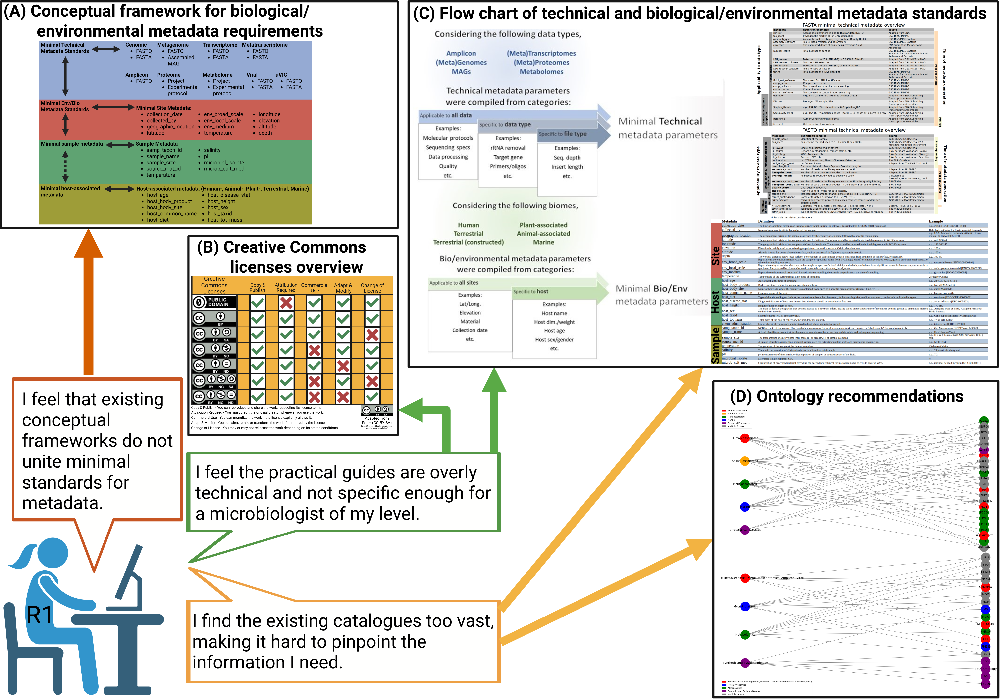
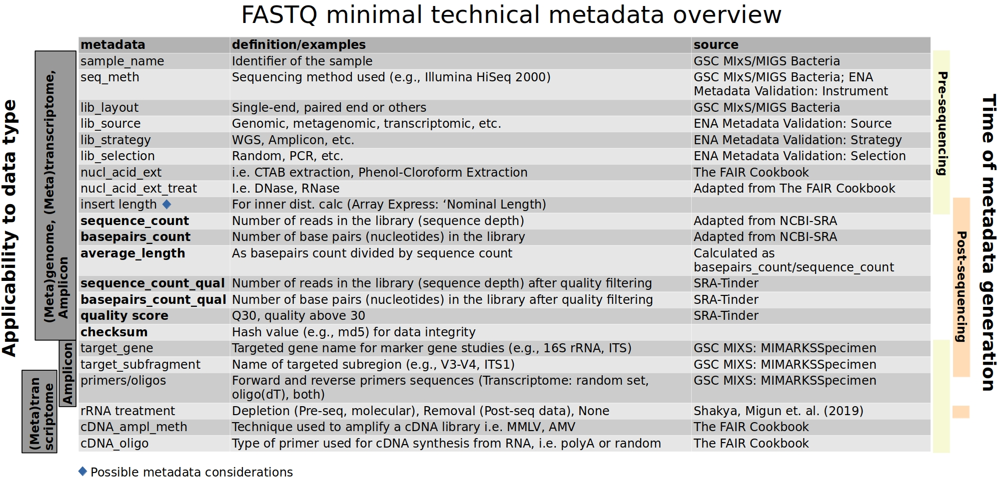
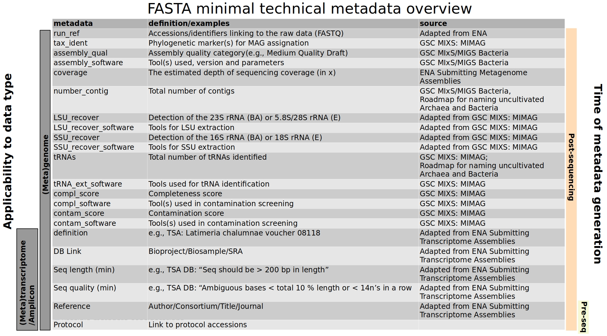
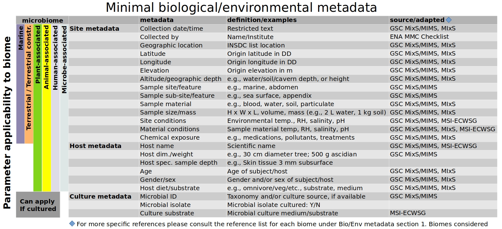
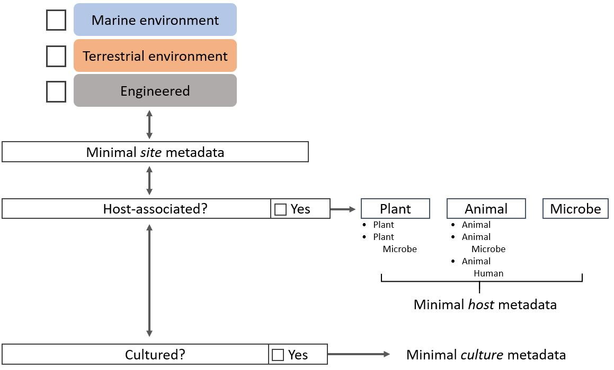
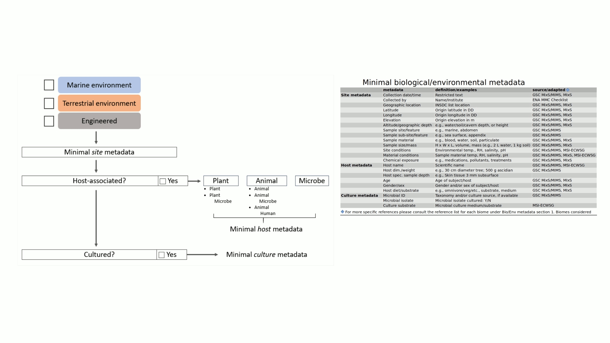
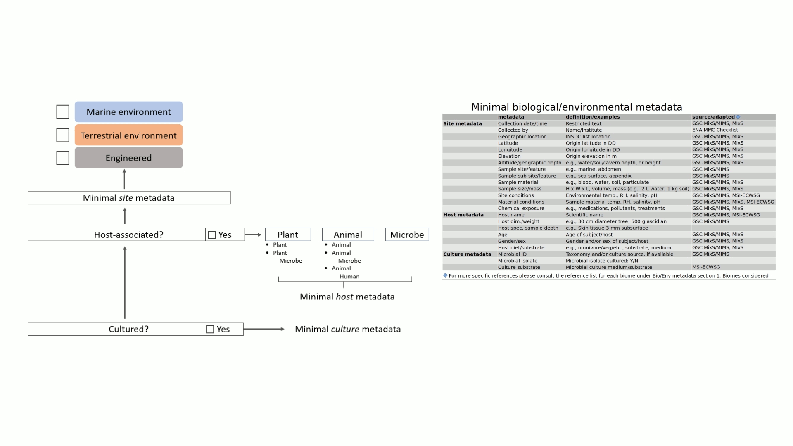

# NFDI4Microbiota - Metadata Standards

> [!TIP]
> For broader research data management, FAIR principles, repository-selection criteria,
> and training material, see the [Knowledge Base](https://knowledgebase.nfdi4microbiota.de)!

## What this repository is

This repository helps microbiota researchers identify relevant metadata fields, community standards, ontology terms, licensing choices, missing-value terms, and repository routes before data deposition.

It does **not** define a new metadata standard and does **not** replace ENA, NCBI SRA, DDBJ, PRIDE, MetaboLights, Metabolomics Workbench, MassIVE/GNPS, Zenodo, Figshare, EGA, dbGaP, JGA, or other repository submission systems. Final validation and submission should always be completed through the target repository.

  

**Figure 1. Conceptual overview of this repository.** The resource organises microbiota-relevant metadata guidance by technical data type, biological/environmental context, sample metadata, host association, licensing, and ontology support.

## Why this repository exists

Microbiota researchers are often asked to submit reusable data and metadata, but repository requirements, community standards, ontology guidance, licensing decisions, and missing-value reporting rules are distributed across many places. This is especially challenging for First Stage Researchers who may be responsible for data submission without extensive training.

This repository provides a practical orientation layer. It helps researchers identify relevant metadata descriptors before deposition and points them to official repository submission systems for final validation and submission.

For broader research data management guidance, FAIR principles, repository-selection criteria, and training material, see the [NFDI4Microbiota Knowledge Base](https://knowledgebase.nfdi4microbiota.de/).

## Start here: metadata preparation workflow

Start with the **[Quick Start guide](./docs/quick_start.md)** if you are preparing a dataset for deposition for the first time.

| Step | What to do | Where to go |
|---|---|---|
| 1 | Plan metadata before sampling or before data generation | [Minimum viable metadata before sampling](./docs/minimum_viable_metadata_before_sampling.md) |
| 2 | Choose the technical data type | [Technical metadata standards](#technical-metadata-standards) |
| 3 | Choose the biological/environmental context | [Biological and environmental metadata standards](#biological-and-environmental-metadata-standards) |
| 4 | Choose the expected repository route | [Repository mapping](./docs/repository_mapping.md) |
| 5 | Prepare local metadata tables and file manifests | [Quick Start](./docs/quick_start.md) |
| 6 | Select ontology or controlled vocabulary terms | [Ontology examples](./docs/ontology_examples.md) |
| 7 | Report absent values correctly | [Missing-value reporting](./docs/missing_values.md) |
| 8 | Check license and access restrictions | [Licensing and access considerations](./docs/licensing_and_access.md) |
| 9 | Validate through repository-specific tools and optional submission helpers | [Quick Start: validation resources](./docs/quick_start.md#step-9-validate-before-final-submission); [submission helper tools](./docs/repository_mapping.md#submission-helper-tools-and-converters) |
| 10 | Submit to the official repository portal | [Quick Start: final submission](./docs/quick_start.md#step-10-submit-to-the-actual-repository) |

Additional practical guidance:

- [Representing complex study designs](./docs/complex_study_designs.md): examples for linking original samples, subsamples, extracts, libraries, processed outputs, time series, and treatment/control designs.
- [Data Availability Statement examples](./docs/data_availability_statement_examples.md): example wording for open repository deposition, controlled-access data, and embargoed data.

## Scope and limitations

| This repository is | This repository is not |
|---|---|
| A practical orientation resource for microbiota metadata preparation | A new metadata standard |
| A guide to existing standards, checklists, ontologies, licenses, missing-value terms, and repository routes | A replacement for repository submission systems |
| A companion resource for First Stage Researchers and data stewards | A legal, ethical, or institutional compliance tool |
| A pre-submission preparation aid | A full automated validator or deposition platform |

# [Technical Metadata Standards](#technical-metadata-standards)

## 2. Technical metadata section

### 2.1. Data types

The following data types were considered when establishing minimal
**technical** metadata standards for M2.1:

-   Genomes
-   Amplicon
-   Metagenomes
-   Metagenome assembled genomes (MAGs)
-   Transcriptomes
-   Metatranscriptomes
-   Proteomes
-   Metabolomes  

Standard parameter considerations for FASTQ and FASTA formats are
displayed in [**Figure 2.**](#figure2) and [**Figure 3.**](#figure3),
respectively. Parameter applicability to different data types and the
time of data generation (i.e., before sequencing or during data
processing) are shown on the left and right, respectively.

Additionally, standards are being considered for [**data transfer and
data integrity**](#data-transfer-data-integrity) to ensure quality is
maintained throughout various processes of data file exchange.   

### 2.2. Overview of minimal technical FASTQ and FASTA metadata considerations

 **Figure 2. Overview of Minimal
Technical Metadata for FASTQ Files**

This figure provides an overview of the minimal technical metadata
relevant to FASTQ files. The left side lists the applicability of
parameters to different data types, such as (meta)genome,
(meta)transcriptome, etc. On the right side, the time of metadata
generation is indicated.   

 **Figure 3. Overview of Minimal
Technical Metadata for FASTA Files**

This figure presents an overview of the minimal technical metadata
relevant to FASTA files. On the left side, the applicability of
parameters to different data types, including (meta)genome,
(meta)transcriptome, etc., is listed. The right side provides
information about the time of metadata generation.   

### 2.3. Minimal technical metadata by technology and file type

Establishing a file-specific metadata standard list poses a significant
challenge due to variations in file types across instruments used in
metabolomic and proteomic analyses. Thus, researchers can find the
metadata standards for each specific technology within corresponding
links. This approach recognizes the complexities of defining
comprehensive and universally applicable metadata standards that differ
based on technology.

-   2.3.1. [Genome Sequencing](./Technical/Genome_Technical_Metadata.md)
    -   Genomic FASTQ
    -   Genomic FASTA
-   2.3.2. [Amplicon
    Sequencing](./Technical/Amplicon_Technical_Metadata.md)
    -   Amplicon FASTQ
-   2.3.3. [Metagenome
    Sequencing](./Technical/Metagenome_Technical_Metadata.md)
    -   Metagenome FASTQ
    -   Metagenome FASTA
    -   Metagenome assembled genome (MAG) FASTA
-   2.3.4. [Transcriptome
    Sequencing](./Technical/Transcriptome_Technical_Metadata.md)
    -   Transcriptome FASTQ
    -   Transcriptome FASTA
-   2.3.5. [Metatranscriptome
    Sequencing](./Technical/Metatranscriptome_Technical_Metadata.md)
    -   Metatranscriptome FASTQ
    -   Metatranscriptome FASTA
-   2.3.6. [Proteome
    sequencing](./Technical/Proteome_Technical_Metadata.md)
    -   Proteome
    -   Proteome - experimental protocol edition
-   2.3.7. [Metabolome
    sequencing](./Technical/Metabolome_Technical_Metadata.md)
    -   Metabolome
    -   Metabolome - experimental protocol edition
-   2.3.8. [uVIGs](./Technical/uVIGs_Technical_Metadata.md)
    -   uVIG FASTQ
    -   uVIG FASTA
- 2.3.9. [Virus Genomes](./Technical/Virus_Technical_Metadata.md)
    -  Virus genome FASTQ/A
-   2.3.10. [BIOM or tabular
    files](./Technical/BIOM_or_Tabular_Technical_Metadata.md)

### 2.4. Data transfer and data integrity

The work of the [Data transfer and data
integrity](./Technical/Data_Transfer_Data_Integrity.md) section focuses
on:

-   Examples of existing data transfer & data integrity checks
-   Data integrity considerations by file type 

# [Biological and Environmental Metadata Standards](#bio-env-metadata-standards)

## 3. Bio/Env metadata section

### 3.1. Biomes considered

Seven microbiomes were considered to compile a minimal set of biological
and environmental metadata standards. Environmental and biological
parameters were identified as minimums applicable to individual biomes
and/or hosts.

The Minimal **Biological and Environmental** microbiome metadata
standards within M2.1 were collected to apply to the following biomes:

-   [Human-associated](./Biological_Environmental/Human_BioEnv_Metadata.md)
-   [Animal-associated](./Biological_Environmental/AnimalAssoc_BioEnv_Metadata.md)
-   [Plant-associated](./Biological_Environmental/PlantAssoc_BioEnv_Metadata.md)
-   [Marine](./Biological_Environmental/Marine_BioEnv_Metadata.md)
-   [Terrestrial](./Biological_Environmental/Terrestrial_BioEnv_Metadata.md)
-   [Built environment](./Biological_Environmental/BuiltEnv_BioEnv_Metadata.md)
-   [Wastewater / engineered water systems](./Biological_Environmental/WasteWater_BioEnv_Metadata.md)

Tentative standard minimal biological and environmental parameter
considerations are displayed in [**Figure 4**](#figure4). Parameter
applicability to different biomes are shown on the left axis.

 **Figure 4. Tentative Minimal
Biological and Environmental Metadata**.

This figure presents the division of minimal biological and
environmental metadata into distinct categories. Site metadata includes
specifications and environmental parameters related to the geographic
sampling location, while sample material and host metadata provide
information specific to host-associated systems. The applicability of
these standards to different microbiomes is shown on the left.
Additionally, conditional metadata standards encompass pertinent minimal
cultivation information.

The references in the figure are from the following sources:

-   **Marine references**:
    -   GSC MIxS: Water MIMS (“GSC MIxS: WaterMIMS”)
    -   ENA MMC: ENA Checklist: Marine Microalgae (“ENA Marine
        Microalgae Checklist; Checklist: ERC000043”)
    -   ENA Tara Oceans; Checklist: ERC000030 (“ENA Tara Oceans;
        Checklist: ERC000030”)
    -   GSC Minimum Information about any (x) Sequence (MIxS); ENA
        checklist: Water environment (“GSC MIxS Water; ENA Checklist:
        ERC000024”)
    -   The environment ontology: contextualising biological and
        biomedical entities (Buttigieg et al. 2013)
    -   The minimum information about a genome sequence (MIGS)
        specification (Field et al. 2008)
    -   Minimum information about a marker gene sequence (MIMARKS) and
        minimum information about any (x) sequence (MIxS) specifications
        (Yilmaz et al. 2011)
    -   A standard MIGS/MIMS compliant XML Schema: Toward the
        development of the Genomic Contextual Data Markup Language
        (GCDML) (Kottmann et al. 2008)
    -   Standard reporting requirements for biological samples in
        metabolomics experiments: environmental context (Morrison et al.
        2007)
-   **Terrestrial / Terrestrial(constructed)**
    -   GSC MIxS: Miscellaneous Natural Or Artificial Environment MIMS
        (“GSC MIxS: MiscellaneousNaturalOrArtificialEnvironmentMIMS”)
    -   GSC MIxS: Sediment MIMS (“GSC MIxS: SedimentMIMS”)
    -   GSC MIXS: Soil MIMS (“GSC MIxS: SoilMIMS”)
    -   GSC MIxS: Wastewater Sludge MIMS (“GSC MIxS:
        WastewaterSludgeMIMS”)
    -   GSC MIxS: Built Environment MIMS (“GSC MIxS:
        BuiltEnvironmentMIMS”)
    -   The environment ontology: contextualising biological and
        biomedical entities (Buttigieg et al. 2013)
    -   The minimum information about a genome sequence (MIGS)
        specification (Field et al. 2008)
    -   Minimum information about a marker gene sequence (MIMARKS) and
        minimum information about any (x) sequence (MIxS) specifications
        (Yilmaz et al. 2011)
    -   A standard MIGS/MIMS compliant XML Schema: Toward the
        development of the Genomic Contextual Data Markup Language
        (GCDML) (Kottmann et al. 2008)
    -   Standard reporting requirements for biological samples in
        metabolomics experiments: environmental context (Morrison et al.
        2007)
-   **Plant-associated**
    -   GSC MIxS: Plant-associated MIMS (“GSC MIxS:
        Plant-associatedMIMS”)
    -   GSC MIxS: Agriculture MIMS (“GSC MIxS: AgricultureMIMS”)
    -   GSC MIxS: Symbiont-associated MIMS (“GSC MIxS:
        Symbiont-associatedMIMS”)
    -   ENA MMC: ENA Checklist: Marine Microalgae (“ENA Marine
        Microalgae Checklist; Checklist: ERC000043”)
    -   The environment ontology: contextualising biological and
        biomedical entities (Buttigieg et al. 2013)
    -   The minimum information about a genome sequence (MIGS)
        specification (Field et al. 2008)
    -   Minimum information about a marker gene sequence (MIMARKS) and
        minimum information about any (x) sequence (MIxS) specifications
        (Yilmaz et al. 2011)
    -   A standard MIGS/MIMS compliant XML Schema: Toward the
        development of the Genomic Contextual Data Markup Language
        (GCDML) (Kottmann et al. 2008)
    -   Standard reporting requirements for biological samples in
        metabolomics experiments: environmental context (Morrison et al.
        2007)
-   **Animal-associated**
    -   GSC MIxS: Host-associated MIMS (“GSC MIxS: Host-associatedMIMS”)
    -   The environment ontology: contextualising biological and
        biomedical entities (Buttigieg et al. 2013)
    -   The minimum information about a genome sequence (MIGS)
        specification (Field et al. 2008)
    -   Minimum information about a marker gene sequence (MIMARKS) and
        minimum information about any (x) sequence (MIxS) specifications
        (Yilmaz et al. 2011)
    -   A standard MIGS/MIMS compliant XML Schema: Toward the
        development of the Genomic Contextual Data Markup Language
        (GCDML) (Kottmann et al. 2008)
    -   Standard reporting requirements for biological samples in
        metabolomics experiments: environmental context (Morrison et al.
        2007)
-   **Human-associated**
    -   MIMS: metagenome/environmental, human-associated; version 6.0
        Package (“MIMS: Metagenome/Environmental, Human-Associated;
        Version 6.0 Package”)
    -   GSC MIxS human associated; ENA Checklist: ERC000014 (“GSC MIxS
        Human Associated; ENA Checklist: ERC000014”)
    -   GSC MIxS: Human-associated MIMS (“GSC MIxS:
        Human-associatedMIMS”)
    -   GSC MIxS: Human-gut MIMS (“GSC MIxS: Human-gutMIMS”)
    -   GSC MIxS: Human-oral MIMS (“GSC MIxS: Human-oralMIMS”)
    -   GSC MIxS: Human-skin MIMS (“GSC MIxS: Human-skinMIMS”)
    -   GSC MIxS: Human-vaginal MIMS (“GSC MIxS: Human-vaginalMIMS”)
    -   The environment ontology: contextualising biological and
        biomedical entities (Buttigieg et al. 2013)
    -   The minimum information about a genome sequence (MIGS)
        specification (Field et al. 2008)
    -   Minimum information about a marker gene sequence (MIMARKS) and
        minimum information about any (x) sequence (MIxS) specifications
        (Yilmaz et al. 2011)
    -   A standard MIGS/MIMS compliant XML Schema: Toward the
        development of the Genomic Contextual Data Markup Language
        (GCDML) (Kottmann et al. 2008)
    -   Standard reporting requirements for biological samples in
        metabolomics experiments: environmental context (Morrison et al.
        2007)
    -   U.S. Office of Management and Budget (OMB): About the Topic of
        Race (“U.s. Office of Management and Budget (OMB): About the
        Topic of Race”)

### 3.2. Data/metadata categorization

The categorization framework in [**Figure 5**](#figure5) should be
considered when determining the applicable metadata standards for each
dataset. This framework can serve as a valuable tool for connecting
information about samples from marine, terrestrial, or engineered
systems. Additionally, it facilitates the inclusion of cultivated
samples, whether they were cultured from a commercially-available source
or isolated from an environmental sample by the user.

To enhance searchability in downstream analyses, users can select
multiple environment categories if relevant. For instance, they may
choose both “marine” and “terrestrial” for a tidal flat site,
“engineered” and “terrestrial” for a greenhouse agricultural site, or
“engineered” and “marine” for a commercially-available culture initially
isolated from the ocean.   

#### **Category Flow Chart**

**Figure 5. Tentative Categorization Framework for
Biological/Environmental Metadata Requirements**

This figure showcases a preliminary categorization framework to
establish minimal biological/environmental metadata requirements. The
framework connects host-associated systems to marine, terrestrial, or
engineered environments while enabling effective tracking of data
affiliated with cultivated samples. The structure should provide
valuable insights for organizing and comprehensively accessing diverse
datasets.

**Figures 6 - 8** show examples of minimal biological/environmental
metadata applicability to different sample categorizations. 

#### **Human Gut Example**

 **Figure 6.
Example of Categorizing a Human Gut-Associated and Cultivated Sample
with Applicable Minimal Metadata**

This figure provides an illustrative example of the categorization
process for a human gut-associated and cultivated sample. It showcases
the minimal metadata that are applicable and relevant for this specific
sample type.

#### **Tidal Flat Example**

 **Figure
7. Example of Categorizing a Tidal Flat and Cultivated Sample with
Applicable Minimal Metadata**

This figure presents a practical example of categorizing a tidal flat
cultivated sample, along with the relevant minimal metadata. The
illustration demonstrates how the proposed framework accommodates
overlapping environments, such as terrestrial and marine, specifically
for intertidal regions.

#### **Lab Culture Example**

 **Figure
8. Example of Categorizing a Known Lab Cultured Sample with Applicable
Minimal Metadata**

This figure presents an example of categorizing a known lab-cultured
sample, along with the corresponding minimal metadata. The
bidirectionality of the categorization framework is highlighted, as it
enables the linkage between known, commercially available cultures and
their original sample environments.

# Practical guidance

## 4. Licensing and access considerations

Licensing determines how data, metadata, documentation, software, and database compilations may be reused. Different research objects may require different license families:

- Creative Commons licenses for data, metadata, documentation, figures, and publications.
- Open Data Commons licenses for databases or structured database compilations.
- OSI-approved/SPDX-listed software licenses for scripts, notebooks, packages, and workflows.
- Controlled-access agreements for sensitive human, clinical, or otherwise restricted data.

For practical guidance, see:

- [Licensing and access considerations](./docs/licensing_and_access.md)

Licensing does not override legal, ethical, privacy, conservation, institutional, funder, or repository restrictions.

## 5. Use of controlled vocabularies and ontologies

Controlled vocabularies and ontologies are related but not identical. A controlled vocabulary provides an approved list of terms. An ontology additionally provides stable identifiers, definitions, and explicit relationships among terms.

Use ontology terms where they improve interoperability and where the target repository accepts them. For examples covering environmental context, host taxonomy, body site, plant structure, sequencing method, growth medium, and chemical compounds, see:

- [Ontology examples for microbiota metadata](./docs/ontology_examples.md)

For broader ontology training and RDM background, see the [NFDI4Microbiota Knowledge Base](https://knowledgebase.nfdi4microbiota.de).

If you find the examples here challenging or want more information, we strongly recommend visiting the [EnvO's use documentation](https://github.com/EnvironmentOntology/envo/wiki/Using-ENVO-with-MIxS) which provides more detailed guidance.

Additional ontology examples for different fields and contexts are available in the dedicated guide:

- [Ontology examples for microbiota metadata](./docs/ontology_examples.md)
- [GitHub page metadata tables with examples](./Biological_Environmental/) for seven different considered biomes.

## 6. Missing-value reporting

Do not leave required metadata fields blank. If a value is absent, report why it is absent using the target repository’s accepted missing-value terms.

Use the dedicated guide:

- [Missing-value reporting](./docs/missing_values.md)

# About

## About NFDI4Microbiota and M2.1

[NFDI4Microbiota](https://nfdi4microbiota.de) is part of the German National Research Data Infrastructure ([NFDI](https://www.nfdi.de/?lang=en)). Within NFDI4Microbiota, Measure 2.1 “Data and Metadata Standards” focuses on improving microbiota data quality by supporting compliance with existing standards and identifying metadata requirements relevant to microbiota research.

This repository contributes to that goal by providing workflow-oriented guidance for identifying relevant technical and biological/environmental metadata before repository submission.

  This work is licensed under a [Creative Commons Attribution 4.0 International License](http://creativecommons.org/licenses/by/4.0/).

# Citation

If you use this repository, please cite the archived repository release:

> Bole M. and NFDI4Microbiota Metadata Standards contributors. **NFDI4Microbiota/MetadataStandards: Pre-review Publication release**. Zenodo. 2026. https://doi.org/10.5281/zenodo.19336648

Please also cite the associated manuscript once it becomes available. Until the manuscript is accepted, published, or posted as a preprint, cite it only where appropriate as a submitted manuscript:

> Bole M., Iyappan A., Ernster N. M., Barysch S. V., Clavel T., Kamath S., de Almeida B. L. S., Magel M., Magnúsdóttir S., Pauvert C., Reimer L., Vandendorpe J., Cassman N. A., Coelho Kasmanas J., Seidel J., Soheili M., McCue L. A., Ponce de Leon Ferreira de Carvalho A. C., and Rocha U. **From FAIR Principles to FAIR Practice in Microbiota Research**. Submitted manuscript.

After publication, replace this submitted-manuscript citation with the final journal citation and DOI.

# References

Bowers, R., N. Kyrpides, R. Stepanauskas, et al. 2017. “Minimum
Information about a Single Amplified Genome (MISAG) and a
Metagenome-Assembled Genome (MIMAG) of Bacteria and Archaea.” *Nat
Biotechnol* 35: 725–31. <https://doi.org/10.1038/nbt.3893>.

Buttigieg, P. L., N. Morrison, B. Smith, C. J. Mungall, S. E. Lewis, and
ENVO Consortium. 2013. “The Environment Ontology: Contextualising
Biological and Biomedical Entities.” *Journal of Biomedical Semantics* 4
(1): 43. <https://doi.org/10.1186/2041-1480-4-43>.

“ENA Marine Microalgae Checklist; Checklist: ERC000043.”
<https://www.ebi.ac.uk/ena/browser/view/ERC000043>.

“ENA Tara Oceans; Checklist: ERC000030.”
<https://www.ebi.ac.uk/ena/browser/view/ERC000030>.

Field, D., G. Garrity, T. Gray, N. Morrison, J. Selengut, P. Sterk, T.
Tatusova, et al. 2008. “The Minimum Information about a Genome Sequence
(MIGS) Specification.” Nature Biotechnology. 2008.
<https://doi.org/10.1038/nbt1360>.

“German National Research Data Infrastructure.”
<https://www.nfdi.de/?lang=en>.

“GSC MIxS Human Associated; ENA Checklist: ERC000014.”
<https://www.ebi.ac.uk/ena/browser/view/ERC000014>.

“GSC MIxS Water; ENA Checklist: ERC000024.”
<https://www.ebi.ac.uk/ena/browser/view/ERC000024>.

“GSC MIxS: AgricultureMIMS.”
<https://genomicsstandardsconsortium.github.io/mixs/AgricultureMIMS/>.

“GSC MIxS: BuiltEnvironmentMIMS.”
<https://genomicsstandardsconsortium.github.io/mixs/BuiltEnvironmentMIMS/>.

“GSC MIxS: Host-associatedMIMS.”
<https://genomicsstandardsconsortium.github.io/mixs/Host-associatedMIMS/>.

“GSC MIxS: Human-associatedMIMS.”
<https://genomicsstandardsconsortium.github.io/mixs/Human-associatedMIMS/>.

“GSC MIxS: Human-gutMIMS.”
<https://genomicsstandardsconsortium.github.io/mixs/Human-gutMIMS/>.

“GSC MIxS: Human-oralMIMS.”
<https://genomicsstandardsconsortium.github.io/mixs/Human-oralMIMS/>.

“GSC MIxS: Human-skinMIMS.”
<https://genomicsstandardsconsortium.github.io/mixs/Human-skinMIMS/>.

“GSC MIxS: Human-vaginalMIMS.”
<https://genomicsstandardsconsortium.github.io/mixs/Human-vaginalMIMS/>.

“GSC MIXS: MicrobialMatBiofilmMIMS.”
<https://genomicsstandardsconsortium.github.io/mixs/MicrobialMatBiofilmMIMS/>.

“GSC MIxS: MiscellaneousNaturalOrArtificialEnvironmentMIMS.”
<https://genomicsstandardsconsortium.github.io/mixs/MiscellaneousNaturalOrArtificialEnvironmentMIMS/>.

“GSC MIxS: Plant-associatedMIMS.”
<https://genomicsstandardsconsortium.github.io/mixs/Plant-associatedMIMS/>.

“GSC MIxS: SedimentMIMS.”
<https://genomicsstandardsconsortium.github.io/mixs/SedimentMIMS/>.

“GSC MIxS: SoilMIMS.”
<https://genomicsstandardsconsortium.github.io/mixs/SoilMIMS/>.

“GSC MIxS: Symbiont-associatedMIMS.”
<https://genomicsstandardsconsortium.github.io/mixs/Symbiont-associatedMIMS/>.

“GSC MIxS: WastewaterSludgeMIMS.”
<https://genomicsstandardsconsortium.github.io/mixs/WastewaterSludgeMIMS/>.

“GSC MIxS: WaterMIMS.”
<https://genomicsstandardsconsortium.github.io/mixs/WaterMIMS/>.

Kottmann, R., T. Gray, S. Murphy, L. Kagan, S. Kravitz, T. Lombardot, D.
Field, F. O. Glöckner, and Genomic Standards Consortium. 2008. “A
Standard MIGS/MIMS Compliant XML Schema: Toward the Development of the
Genomic Contextual Data Markup Language (GCDML).” OMICS: A Journal of
Integrative Biology. 2008. <https://doi.org/10.1089/omi.2008.0A10>.

“MIMS: Metagenome/Environmental, Human-Associated; Version 6.0 Package.”
<https://www.ncbi.nlm.nih.gov/biosample/docs/packages/MIMS.me.human-associated.5.0/>.

Morrison, Norman, Daniel Bearden, Jacob G. Bundy, Timothy Collette,
Fraser Currie, Matthew Davey, Migdalia Dominguez, et al. 2007. “Standard
Reporting Requirements for Biological Samples in Metabolomics
Experiments: Environmental Context.” *Metabolomics* 3 (2): 203–10.
<https://doi.org/10.1007/s11306-007-0067-1>.

Murray, A. E., J. Freudenstein, S. Gribaldo, et al. 2020. “Roadmap for
Naming Uncultivated Archaea and Bacteria.” *Nat Microbiol* 5: 987–94.
<https://doi.org/10.1038/s41564-020-0733-x>.

“NFDI4Microbiota.” <https://nfdi4microbiota.de/>.

“U.s. Office of Management and Budget (OMB): About the Topic of Race.”
<https://www.census.gov/topics/population/race/about.html>.

Yilmaz, Pelin et al. 2011. “Minimum Information about a Marker Gene
Sequence (MIMARKS) and Minimum Information about Any (x) Sequence (MIxS)
Specifications.” *Nature Biotechnology* 29 (5): 415–20.
<https://doi.org/10.1038/nbt.1823>.
