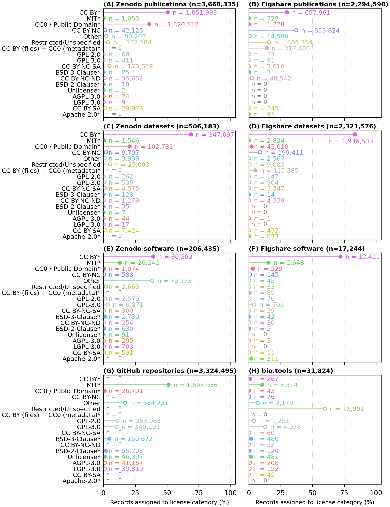

# Licensing and access considerations

Licensing defines the legal conditions under which research outputs can be reused. Access conditions define whether and how users can obtain the data. These are related but not identical.

A permissive license does not override privacy, ethics, data protection, Nagoya Protocol, conservation, institutional, funder, or repository restrictions.

This page is general guidance only. For final licensing and access decisions, follow institutional, funder, ethics, legal, and repository guidance.

---

  

**Figure 1. License usage across research object repositories and registries.** Adapted from the associated manuscript figure. Created in BioRender.

---
## 1. Choose the license by research object

Different research objects may need different license families.

| Research object | Typical license family | Examples |
|---|---|---|
| Article text, documentation, teaching material, README text | [Creative Commons](https://creativecommons.org/) | [CC BY 4.0](https://creativecommons.org/licenses/by/4.0/), [CC BY-SA 4.0](https://creativecommons.org/licenses/by-sa/4.0/) , [CC0](https://creativecommons.org/publicdomain/zero/1.0/) |
| Metadata records | [Creative Commons](https://creativecommons.org/) or public-domain dedication | [CC0](https://creativecommons.org/publicdomain/zero/1.0/), [CC BY 4.0](https://creativecommons.org/licenses/by/4.0/) |
| Datasets / data files | [Creative Commons](https://creativecommons.org/) or repository-specific data license | [CC0](https://creativecommons.org/publicdomain/zero/1.0/), [CC BY 4.0](https://creativecommons.org/licenses/by/4.0/) |
| Databases / structured database compilations | [Open Data Commons](https://opendatacommons.org/) | [PDDL](https://opendatacommons.org/licenses/pddl/), [ODC-By](https://opendatacommons.org/licenses/by/), [ODbL](https://opendatacommons.org/licenses/odbl/) |
| Software, scripts, notebooks, workflows, packages | [Open-source software licenses](https://opensource.org/licenses) using [SPDX identifiers](https://spdx.org/licenses/) | [MIT](https://opensource.org/license/mit), [Apache-2.0](https://opensource.org/license/apache-2.0), [BSD-2-Clause](https://opensource.org/license/bsd-2-clause), [BSD-3-Clause](https://opensource.org/license/bsd-3-clause), [GPL-3.0](https://opensource.org/license/gpl-3.0), [LGPL-3.0](https://opensource.org/license/lgpl-3-0), [AGPL-3.0](https://opensource.org/license/agpl-3-0), [Unlicense](https://unlicense.org/) |
| Sensitive human or controlled-access data | Data-use agreement / access governance, not open licensing alone | EGA, dbGaP, JGA, institutional DAC route |

---

## 2. Creative Commons licenses for data, metadata, and documentation

[Creative Commons](https://creativecommons.org/) licenses are widely used for sharing research outputs such as datasets, metadata, publications, documentation, figures, and training material.

| License | Reuse summary | Typical use |
|---|---|---|
| [CC0](https://creativecommons.org/publicdomain/zero/1.0/) | Public-domain dedication; maximises reuse where legally possible | Metadata, data intended for unrestricted reuse |
| [CC BY 4.0](https://creativecommons.org/licenses/by/4.0/) | Reuse allowed with attribution | Data, documentation, figures, teaching material |
| [CC BY-SA 4.0](https://creativecommons.org/licenses/by-sa/4.0/) | Reuse allowed with attribution and share-alike | Documentation or training material where derivatives should stay similarly licensed |
| [CC BY-NC](https://creativecommons.org/licenses/by-nc/4.0/) | Reuse with attribution for non-commercial purposes only | More restrictive data/documentation reuse |
| [CC BY-ND](https://creativecommons.org/licenses/by-nd/4.0/) | Redistribution allowed, but no derivatives | Rarely ideal for reusable scientific data |
| [CC BY-NC-SA](https://creativecommons.org/licenses/by-nc-sa/4.0/) | Non-commercial reuse with attribution and share-alike | Restrictive educational/documentation use |
| [CC BY-NC-ND](https://creativecommons.org/licenses/by-nc-nd/4.0/) | Non-commercial redistribution only, no derivatives | Least reusable CC option |

For FAIR reuse, prefer [CC0](https://creativecommons.org/publicdomain/zero/1.0/) or [CC BY](https://creativecommons.org/licenses/by/4.0/) where legally and ethically appropriate.

---

## 3. Open Data Commons licenses for databases

[Open Data Commons](https://opendatacommons.org/) licenses are designed for data and databases.

| License | Reuse summary | Typical use |
|---|---|---|
| [PDDL](https://opendatacommons.org/licenses/pddl/) | Public-domain dedication for databases/data | Maximum reuse of database contents |
| [ODC-By](https://opendatacommons.org/licenses/by/) | Attribution license for databases/data | Databases where attribution is required |
| [ODbL](https://opendatacommons.org/licenses/odbl/) | Attribution and share-alike for databases/data | Databases where adapted databases should remain open |

Use [Open Data Commons](https://opendatacommons.org/) licenses when the research output is a structured database or database compilation and the repository supports these licenses.

---

## 4. Software licenses for scripts, workflows, notebooks, and code

Software should not usually be licensed only under a [Creative Commons](https://creativecommons.org/) license. Use a software license with a standard [SPDX identifier](https://spdx.org/licenses/).

| License | Type | Notes |
|---|---|---|
| [MIT](https://opensource.org/license/mit) | Permissive | Simple, widely used; allows reuse with attribution/license notice |
| [Apache-2.0](https://opensource.org/license/apache-2.0) | Permissive | Includes explicit patent grant |
| [BSD-2-Clause](https://opensource.org/license/bsd-2-clause) | Permissive | Short permissive software license |
| [BSD-3-Clause](https://opensource.org/license/bsd-3-clause) | Permissive | Similar to BSD-2-Clause with non-endorsement clause |
| [GPL-3.0](https://opensource.org/license/gpl-3.0) | Strong copyleft | Derivative distributed software must remain GPL-compatible |
| [LGPL-3.0](https://opensource.org/license/lgpl-3-0) | Weak copyleft | Often used for libraries |
| [AGPL-3.0](https://opensource.org/license/agpl-3-0) | Network copyleft | Relevant for web services or network-accessed software |
| [Unlicense](https://unlicense.org/) | Public-domain-style software license | Maximum reuse where accepted |

Use [SPDX identifiers](https://spdx.org/licenses/) in repository metadata, `CITATION.cff`, `codemeta.json`, package metadata, and file headers where appropriate.

---

## 5. Access conditions are separate from licenses

Before choosing a license, check whether the data can be openly shared.

Examples requiring caution:

- human participant data
- clinical metadata
- personal data under GDPR or equivalent frameworks
- exact locations of endangered species
- pathogen-risk or dual-use information
- indigenous data governance or Nagoya Protocol relevance
- institutional, funder, or consent restrictions

If data cannot be openly shared, use a controlled-access repository or access-governance route. Do not solve access restrictions by choosing an unclear license.

---

## 6. Practical checklist

- [ ] Identify each research object: data, metadata, database, code, figures, documentation.
- [ ] Assign a suitable license family to each object.
- [ ] Prefer [CC0](https://creativecommons.org/publicdomain/zero/1.0/) or [CC BY](https://creativecommons.org/licenses/by/4.0/) for reusable metadata/data where legally possible.
- [ ] Use [Open Data Commons](https://opendatacommons.org/) licenses for database compilations when appropriate.
- [ ] Use an [OSI-approved](https://opensource.org/licenses)/[SPDX-listed software license](https://spdx.org/licenses/) for code.
- [ ] Check repository-supported license options.
- [ ] Check funder, publisher, institutional, and ethics requirements.
- [ ] Document access restrictions separately from the license.
- [ ] Ensure the Data Availability Statement matches the repository license and access status.
