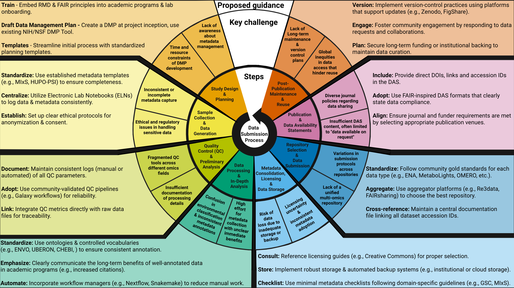

# Quick Start: preparing microbiota metadata for repository submission

This page helps researchers, especially First Stage Researchers (R1), identify the metadata they should prepare before submitting microbiota data to a public or controlled-access repository.

This repository does **not replace repository-specific submission systems**. Always complete final validation and deposition in the target repository portal.

For broader research data management guidance, repository-selection criteria, licensing background, and FAIR concepts, see the [NFDI4Microbiota Knowledge Base](https://knowledgebase.nfdi4microbiota.de/)

---

  

**Figure 1. Data submission process: steps, key challenges, and proposed guidance.** Adapted from the associated manuscript figure. Created in BioRender.

---
## Step 1. Choose your technical data type

Select the data type that best describes the primary data you will deposit.

Currently covered in this repository:

- [Amplicon sequencing](../Technical/Amplicon_Technical_Metadata.md)
- [Genome sequencing](../Technical/Genome_Technical_Metadata.md)
- [Metagenome sequencing](../Technical/Metagenome_Technical_Metadata.md)
- [Metagenome-assembled genomes (MAGs)](../Technical/Metagenome_Technical_Metadata.md)
- [Transcriptome sequencing](../Technical/Transcriptome_Technical_Metadata.md)
- [Metatranscriptome sequencing](../Technical/Metatranscriptome_Technical_Metadata.md)
- [Proteome / proteomics](../Technical/Proteome_Technical_Metadata.md)
- [Metabolome / metabolomics](../Technical/Metabolome_Technical_Metadata.md)
- [Virus genomes](../Technical/Virus_Technical_Metadata.md)
- [uVIGs](../Technical/uVIGs_Technical_Metadata.md)

Recommended action:

1. Open the matching technical metadata page.
2. Download the relevant TSV/XLSX template when available.
3. Record fields before data generation/collection and submission.
4. Keep local sample identifiers consistent across all files and metadata tables.

---

## Step 2. Choose your biological or environmental context

Select the context that best describes the sample origin.

Currently covered in this repository:

- [Human-associated](../Biological_Environmental/Human_BioEnv_Metadata.md)
- [Animal-associated](../Biological_Environmental/AnimalAssoc_BioEnv_Metadata.md)
- [Plant-associated](../Biological_Environmental/PlantAssoc_BioEnv_Metadata.md)
- [Marine](../Biological_Environmental/Marine_BioEnv_Metadata.md)
- [Terrestrial](../Biological_Environmental/Terrestrial_BioEnv_Metadata.md)
- [Built environment](../Biological_Environmental/BuiltEnv_BioEnv_Metadata.md)
- [Wastewater / engineered water systems](../Biological_Environmental/WasteWater_BioEnv_Metadata.md)

Recommended action:

1. Open the matching biological/environmental metadata page.
2. Combine the biological/environmental metadata fields with the relevant technical metadata fields.
3. Record contextual metadata as early as possible, preferably before sampling.

---

## Step 3. Choose the expected repository

Use a domain-specific repository whenever one is available and appropriate. Use a generalist repository only for supplementary outputs, small supporting files, teaching examples, or data types without a suitable domain repository.

| Data/output type | Recommended repository route | Notes |
|---|---|---|
| Amplicon, genome, metagenome, MAG, transcriptome, metatranscriptome, virus/uVIG sequence data | ENA, NCBI SRA, or DDBJ/DRA through INSDC routes | Use ENA Webin/Webin-CLI, NCBI Submission Portal, or DDBJ D-way/DRA. |
| Proteomics / metaproteomics | PRIDE / ProteomeXchange or MassIVE | Use the repository-specific submission tool and validation route. |
| Metabolomics | MetaboLights or Metabolomics Workbench | Use repository templates, guided submission, and repository validation. |
| MS/MS spectral data and molecular networking workflows | MassIVE / GNPS | Use MassIVE/GNPS-specific submission and documentation routes. |
| General supplementary data, small supporting files, figures, tables, scripts, and release archives | Zenodo, Figshare, or institutional repository | Do not use as the primary archive when a domain-specific repository is required. |
| Sensitive human genotype/phenotype or omics data requiring controlled access | EGA, dbGaP, or JGA | Confirm consent, ethics approval, governance, and access conditions before deposition. |

Unsure which EMBL-EBI archive is appropriate, use the [EMBL-EBI Data Submission Wizard](https://www.ebi.ac.uk/submission/) before starting deposition. The wizard helps you identify the repository for which your data are most suited. 
For general repository-selection criteria and repository finder links, see: 

- [NFDI4Microbiota Knowledge Base - Data Repositories](https://knowledgebase.nfdi4microbiota.de/RDM-Share/data-repositories.html)
- [Repository mapping for microbiota metadata preparation](../docs/repository_mapping.md)

---

## Step 4. Download or prepare the relevant metadata sheet

Use the repository tables in this GitHub repository to prepare a local metadata sheet.

Recommended local workbook structure:

- `README`
- `technical_metadata`
- `sample_metadata` and `biological_environmental_metadata`
- `ontology_terms`
- `missing_values`
- `file_manifest`
- `repository_mapping`
- `license_and_access`

Keep one stable `sample_id` or `sample_name` across all sheets, raw files, processed files, and repository submission forms.

---

## Step 5. Fill required and recommended fields

For each field, record:

- field name
- definition
- expected format
- unit
- ontology or controlled vocabulary, where applicable
- example value
- required/recommended/conditional/optional status, where available from the target repository or checklist,
- missing-value term, if no value can be supplied
- source standard or checklist
- repository-specific field name, if different

Do not leave required fields blank. If a value is absent, use the repository-approved missing-value term.

---

## Step 6. Use recommended ontology terms

Use ontology terms where they are expected or strongly recommended.

Useful lookup services:

- [EMBL-EBI Ontology Lookup Service](https://www.ebi.ac.uk/ols4/)
- [OBO Foundry](https://obofoundry.org/)
- [BioPortal](https://bioportal.bioontology.org/)
- [ZOOMA](https://www.ebi.ac.uk/spot/zooma/)

Recommended practice:

1. Search by label.
2. Check the definition.
3. Check the parent class.
4. Prefer stable ontology identifiers over free text.
5. Record both the human-readable label and the ontology identifier.
6. Do not force an ontology term if no suitable term exists; follow repository guidance.

More examples can be found in:

- [Ontology examples for microbiota metadata](../docs/ontology_examples.md)
- [Biological/environmental Metadata Tables](../Biological_Environmental/)

---

## Step 7. Use approved missing-value terms

When a value is absent, explain why.

Use this repository’s missing-value guide and then check the target repository’s accepted terms.

Typical cases:

| Situation | Prefer | Avoid |
|---|---|---|
| Field does not apply | `not applicable` | blank cell |
| Value exists but cannot be obtained | `not available` | `NA` without explanation |
| Measurement was never captured | `not recorded` or repository-approved equivalent | invented values |
| Value exists but will be supplied later | `not provided` or repository-approved equivalent | vague `unknown` |
| Value exists but cannot be shared openly | `restricted access` | removing the field entirely |

More information can be found in:

- [Missing-value reporting](../docs/missing_values.md)
- [INSDC Missing Value Reporting Terms](https://www.insdc.org/technical-specifications/missing-value-reporting/)
- [DataCite - Appendix 3: Standard values for unknown information](https://datacite-metadata-schema.readthedocs.io/en/4.6/appendices/appendix-3/#appendix-3-standard-values-for-unknown-information)  
- [ISO 19115-3](https://schemas.isotc211.org/19115/-3/gco/1.0/gco/)  

---

## Step 8. Check license and access restrictions

Before submission, decide:

- Is the dataset open, embargoed, restricted, or controlled access?
- Is there human participant information, pathogen-risk information, endangered-species location information, Nagoya Protocol relevance, or other governance concern?
- Which license applies to data, metadata, code, and documentation?
- Does the selected repository allow the intended license/access condition?
- Does the manuscript Data Availability Statement match the actual repository record?

For broad licensing background, see: 

- [NFDI4Microbiota Knowledge Base - License](https://knowledgebase.nfdi4microbiota.de/RDM-Share/licenses.html)
- [Licensing and access considerations](../docs/licensing_and_access.md)
  
For the final legal/access choice, follow institutional, funder, ethics, and repository guidance.

---

## Step 9. Validate before final submission

Use repository-specific validation whenever possible.

| Resource | Use for | Validation or checking role |
|---|---|---|
| [ENA Webin / Webin-CLI](https://ena-docs.readthedocs.io/en/latest/submit/general-guide/webin-cli.html) | Sequence reads, assemblies, analyses | Webin-CLI provides strong pre-submission validation for supported file types. |
| [ENA Sample Checklists / BioSamples validation](https://www.ebi.ac.uk/ena/browser/checklists) | Sequence-associated sample metadata | Use the most relevant checklist and mandatory/recommended/optional fields. |
| [NCBI SRA Submission Portal](https://www.ncbi.nlm.nih.gov/sra/docs/submit/) | Sequence read submissions to NCBI | Use the portal wizard and resolve validation warnings/errors. |
| [DDBJ D-way / DRA](https://www.ddbj.nig.ac.jp/ddbj-account-e.html) | DDBJ sequence-read submissions | Validate metadata and data files through the DRA workflow. |
| [NMDC Submission Portal / NMDC submission schema](https://data.microbiomedata.org/submission/home) | Microbiome-oriented metadata preparation and schema alignment | Useful for MIxS-like metadata and ontology-aware preparation; not a replacement for the final target repository unless depositing through NMDC-supported routes. |
| [PRIDE / ProteomeXchange submission tools](https://www.ebi.ac.uk/pride/markdownpage/pridesubmissiontool) | Proteomics / metaproteomics | Use repository-specific validation and accession workflow. |
| [MassIVE / GNPS](https://ccms-ucsd.github.io/GNPSDocumentation/datasets/) | Mass spectrometry datasets and spectral workflows | Use MassIVE/GNPS submission requirements and reviewer/accession workflow. |
| [MetaboLights validation](https://untargeted-metabolomics-workflow.netlify.app/08_data-archiving-citation/02_metabolights/) | Metabolomics | Run study validation and fix all errors before release/private status. |
| [Metabolomics Workbench submission checks](https://metabolomicsworkbench.org/data/DRCCDataDeposit.php) | Metabolomics | Use repository tutorials, metadata requirements, and exemplary studies before submission. |
| [Zenodo](https://zenodo.org/) / [Figshare checks](https://figshare.com/) | Generalist outputs | Use only when a domain repository is not required or for supplementary/release artefacts. |

Additional helper tools and converters, including Galaxy ENA upload, annonex2embl, EMBL2checklists, METAGENOTE, subMG, and other submission-support workflows, are listed in the [Repository mapping](../docs/repository_mapping.md#submission-helper-tools-and-converters). These tools may reduce formatting or upload burden, but they do not replace final validation through the target repository.

---

## Step 10. Submit to the actual repository

After metadata preparation:

1. Create or log into the target repository account.
2. Start the submission in the official portal.
3. Copy or upload prepared metadata.
4. Upload data files.
5. Register checksums or use repository-managed file validation.
6. Fix all validation errors.
7. Record accession numbers, DOIs, reviewer links, and embargo/release dates.
8. Update the manuscript Data Availability Statement with a Persistent Identifier (PID).
9. Keep a local and remote copy of the submitted metadata and final repository receipt.
