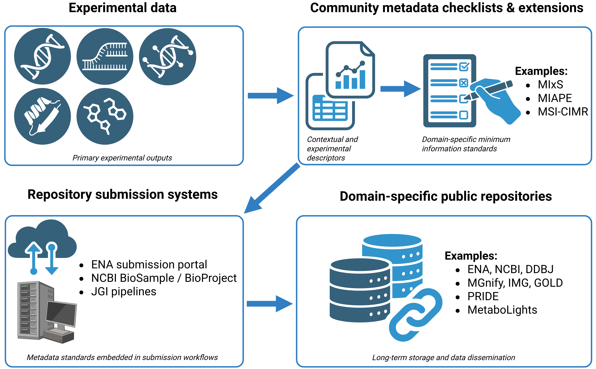

# Repository mapping for microbiota metadata preparation

  

**Figure 1. Community metadata standards integrated into data submission workflows.**
--
This page provides a compact orientation for choosing a likely repository route during metadata preparation.

For general repository-selection criteria, repository finders, and a broader microbiology repository list, see the [NFDI4Microbiota Knowledge Base - Data Repositories](https://knowledgebase.nfdi4microbiota.de/RDM-Share/data-repositories.html)

This page does not replace repository-specific submission guidance.

| Data type / output | Likely repository route | Submission / validation resource | Use this GitHub repository for |
|---|---|---|---|
| Amplicon reads | ENA / NCBI SRA / DDBJ-DRA | ENA Webin, NCBI SRA Submission Portal, DDBJ D-way | Preparing sample, technical, and biological/environmental metadata before submission |
| Genomes | ENA / GenBank / DDBJ | ENA Webin/Webin-CLI, NCBI Submission Portal, DDBJ workflows | Preparing sequencing, assembly, organism, and provenance metadata |
| Metagenomes | ENA / NCBI SRA / DDBJ-DRA | ENA checklists, Webin/Webin-CLI, NCBI SRA Portal, DDBJ DRA validation | Preparing MIxS-aligned sample/context metadata |
| MAGs | ENA / NCBI / DDBJ assembly-related routes | Repository-specific assembly/MAG submission routes | Preparing assembly quality, binning, completeness, contamination, and provenance metadata |
| Metatranscriptomes | ENA / NCBI SRA / DDBJ-DRA; possibly GEO/ArrayExpress/GEA for processed expression outputs | ENA Webin, NCBI SRA/GEO guidance, DDBJ DRA/GEA | Preparing raw-read and experimental metadata |
| Transcriptomes | ENA / NCBI SRA / DDBJ-DRA; GEO/ArrayExpress/GEA for expression matrices where appropriate | ENA, NCBI, DDBJ repository-specific workflows | Preparing sequencing, library, sample, and analysis metadata |
| Proteomics | PRIDE / ProteomeXchange; MassIVE where appropriate | PX Submission Tool, PRIDE guidance, MassIVE submission | Preparing sample, instrument, protocol, and analysis metadata |
| Metaproteomics | PRIDE / ProteomeXchange or MassIVE | PX Submission Tool or MassIVE | Add a metaproteome-specific page/template before advertising full repository coverage |
| Metabolomics | MetaboLights or Metabolomics Workbench | MetaboLights Guided Submission/validation; Metabolomics Workbench upload/manage studies | Preparing biological, analytical, sample, assay, and metabolite metadata |
| MS/MS spectral data / molecular networking | MassIVE / GNPS | MassIVE/GNPS submission workflows | Preparing file manifest, sample mapping, and provenance metadata |
| Virus genomes / uVIGs | ENA / NCBI / DDBJ sequence repositories; specialised pathogen resources where appropriate | ENA/NCBI/DDBJ validation and pathogen-specific guidance where applicable | Preparing MIxS/MIUViG-related metadata |
| General supplementary files, scripts, figures, release archives | Zenodo, Figshare, institutional repository | Repository deposit form and DOI metadata | Preparing citation, license, file manifest, and access metadata |
| Sensitive human genotype/phenotype or omics data | EGA, dbGaP, JGA, or national controlled-access archive | Controlled-access submission and governance workflow | Preparing non-sensitive metadata and access-condition documentation before controlled-access submission |

## Important rule

Use domain-specific repositories first. Use generalist repositories for supplementary files, release artefacts, or data types without a suitable domain-specific repository.

## Repository discovery

Use these external resources when no clear repository is obvious:

- [NFDI4Microbiota Knowledge Base - Data Repositories](https://knowledgebase.nfdi4microbiota.de/RDM-Share/data-repositories.html)
- [FAIRsharing](https://fairsharing.org/)
- [re3data](https://www.re3data.org/)
- [EMBL-EBI Data Submission Wizard](https://www.ebi.ac.uk/submission/)
- [ELIXIR deposition database resources](https://elixir-europe.org/platforms/data/elixir-deposition-databases)
